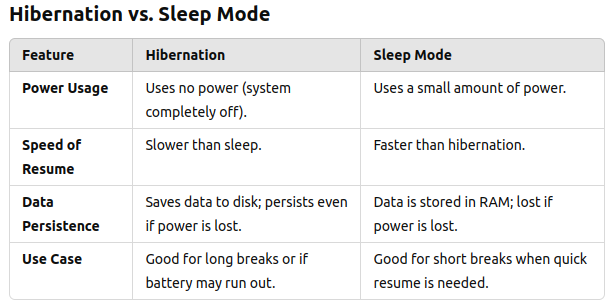
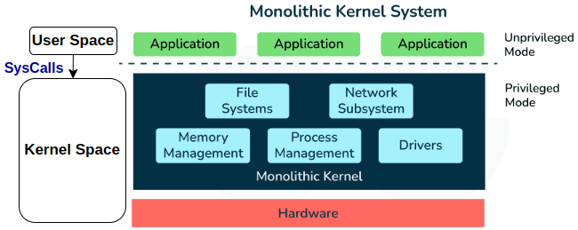
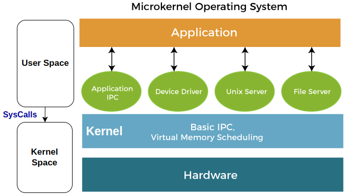
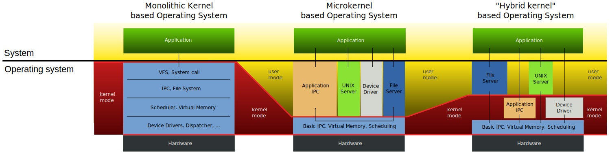
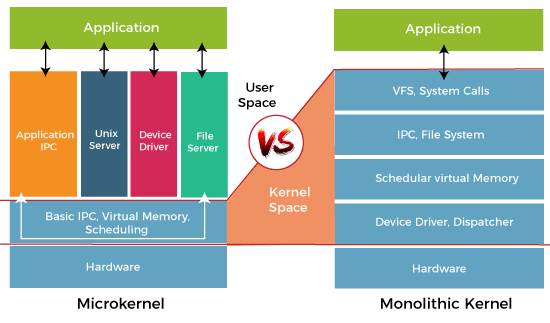

# Real-Time Operating System (RTOS)

A **Real-Time Operating System (RTOS)** is a specialized type of operating system designed to process data and execute tasks within strict timing constraints. It ensures that critical operations are performed within predefined deadlines, making it essential for applications where timing, reliability, and predictability are crucial.  

### 1. Features of RTOS

**1.1. Deterministic Behavior**:

- An RTOS guarantees predictable response times to events. It prioritizes real-time tasks over non-critical ones, ensuring that high-priority tasks are completed within their deadlines.

**1.2. Real-Time Scheduling**:

- RTOS uses scheduling algorithms like:
  - **Priority-based Preemptive Scheduling**: Tasks with higher priority preempt lower-priority tasks.
  - **Round Robin with Time Slicing**: Ensures fairness among tasks of equal priority.
  - **Rate Monotonic Scheduling (RMS)** and **Earliest Deadline First (EDF)**: Used in hard real-time systems to schedule periodic tasks.

**1.3. Small Footprint**:

- RTOSs are lightweight and optimized for resource-constrained environments like embedded systems.

**1.4. Multitasking**:

- It supports multitasking, allowing concurrent execution of multiple tasks (threads or processes).

**1.5. Inter-Task Communication and Synchronization**:

- RTOS provides mechanisms like semaphores, message queues, and mutexes to manage communication and synchronization between tasks.

**1.6. Real-Time Clock (RTC) Support**:

- Maintains accurate timing to ensure time-sensitive tasks run as required.

### 2. Types of RTOS

**2.1. Hard Real-Time Systems**:

- Tasks must meet deadlines under all circumstances. Failure to do so can result in catastrophic consequences.
- Example: Aerospace systems, pacemakers, anti-lock braking systems (ABS).

**2.2. Soft Real-Time Systems**:

- Deadlines are important but not critical. Occasional deadline misses are tolerable.
- Example: Video streaming, audio processing.

**2.3. Firm Real-Time Systems**:

- A task missing a deadline does not cause a complete system failure, but the task loses its value.
- Example: Industrial automation systems.

### 3. RTOS vs General-Purpose Operating Systems (GPOS)

| Feature        | RTOS                                   | GPOS                              |
| -------------- | -------------------------------------- | --------------------------------- |
| **Timing**     | Predictable and deterministic          | Best-effort, no timing guarantees |
| **Scheduling** | Real-time priority-based               | Fairness and throughput focused   |
| **Latency**    | Minimal (microseconds to milliseconds) | High (milliseconds to seconds)    |
| **Footprint**  | Small, lightweight                     | Larger, with many features        |
| **Use Case**   | Embedded, time-critical systems        | General-purpose systems           |

### 4. Full-featured RTOS
Modern **Real-Time Operating Systems (RTOS)** are designed to fully utilize the capabilities of **multi-core CPUs**, while maintaining high levels of **safety**, **security**, **scalability**, and **low latency**. These features are essential for meeting the demands of modern applications, such as autonomous vehicles, robotics, aerospace systems, and IoT devices.

#### 4.1. Features of RTOS for Multi-Core CPUs

#### **4.1.1. Safety**

- Certifications:
  - Designed to comply with industry safety standards like **ISO 26262** (automotive), **DO-178C** (aerospace), and **IEC 61508** (industrial automation).
- Fault Isolation:
  - Ensures that faults in one core or process do not propagate to others, critical in safety-critical systems.
- Redundancy:
  - Supports **failover mechanisms** and redundancy for applications where safety is paramount, such as avionics or medical devices.
- Deterministic Behavior:
  - Guarantees task completion within predictable time bounds, even under high system load or failures.

#### **4.1.2. Security**

- Memory Protection:
  - Leverages multi-core hardware capabilities like **MMUs (Memory Management Units)** to provide process isolation.
- Secure Boot:
  - Ensures that only authenticated and verified software runs, protecting the system from tampering during startup.
- Data Encryption:
  - Incorporates secure communication protocols like TLS and encryption algorithms to protect data in transit and at rest.
- Real-Time Security Updates:
  - Multi-core systems allow secure tasks (e.g., applying patches) to run concurrently with real-time tasks without disrupting operations.

#### 4.1.3. Scalability

- Dynamic Load Balancing:
  - Dynamically distributes workloads across cores to optimize resource utilization and meet real-time deadlines.
- Modular Architecture:
  - Allows scaling from simple single-core setups to complex multi-core configurations without extensive rewrites.
- Thread Affinity:
  - Supports pinning specific tasks to particular cores for fine-grained performance control.
- Asymmetric Multiprocessing (AMP):
  - Enables cores to run different tasks or even different operating systems.
- Symmetric Multiprocessing (SMP):
  - Supports shared memory and task distribution across cores to maximize performance.

#### **4.1.4. Latency**

- Low-Latency Kernel:
  - Real-time kernels are optimized for microsecond-level response times to handle interrupts and events efficiently.
- Priority-Based Scheduling:
  - Critical tasks are given precedence, minimizing delays for high-priority operations.
- Interrupt Management:
  - Advanced interrupt handling ensures minimal disruption of time-sensitive tasks.
- Cache Optimization:
  - Designed to reduce cache thrashing on multi-core processors, improving response times.

### 5. Examples of RTOS Designed for Modern Multi-Core Systems

1. **QNX Neutrino RTOS:**
   - Microkernel design with support for SMP and AMP.
   - Widely used in automotive, industrial, and medical applications.
2. **VxWorks:**
   - Scalable RTOS with support for multi-core processors.
   - Offers safety-critical certifications and low-latency performance.
3. **FreeRTOS+TCP:**
   - Open-source RTOS supporting multi-core and real-time networking.
4. **Zephyr OS:**
   - Modular, lightweight, and secure RTOS for IoT and embedded multi-core systems.
5. **RTEMS (Real-Time Executive for Multiprocessor Systems):**
   - Focused on scalability and real-time performance in multi-core environments.

### 6. Applications Leveraging Multi-Core RTOS

1. **Autonomous Vehicles:**
   - Safety-critical tasks like sensor fusion, path planning, and object detection across multiple cores.
2. **Industrial Robotics:**
   - Real-time coordination of multi-axis motion controllers.
3. **5G Networking:**
   - Low-latency packet processing and security management.
4. **Aerospace and Defense:**
   - Mission-critical systems with fault tolerance and redundancy.
5. **Smart IoT Gateways:**
   - Real-time data processing, security, and scalability in edge computing.

By leveraging multi-core architectures, modern RTOSs balance these priorities to meet the growing complexity of real-time systems while ensuring safety, security, scalability, and low latency.

------------------

### 7. Kernel 

The kernel is the core of an operating system that acts as a bridge between the hardware and software. It provides low-level abstractions for hardware resources, manages system resources, and facilitates communication between hardware and applications.

#### 7.1. Kernel Functions

**7.1.1. Process Management**

- Handles process creation, execution, suspension, and termination.
- Manages process scheduling to ensure fair CPU time allocation.
- Handles inter-process communication (IPC) and synchronization.

**7.1.2.  Memory Management**

- Allocates and deallocates memory for processes.

- Manages virtual memory, paging, and swapping to optimize RAM usage.

  >##### 7.1.2.1. Virtual Memory VM :
  >
  >**Virtual memory** is a technique that allows the OS to use more memory than is physically available on the system by creating a virtual address space. 
  >
  >Applications operate as if they have access to a large, contiguous block of memory, even if the physical RAM is smaller or fragmented.
  >
  >**How It Works**
  >
  >- The **kernel** maps virtual addresses (used by applications) to physical addresses (actual RAM locations) using a **page table**.
  >
  >- This abstraction allows:
  >
  >  - Multiple processes to coexist without directly interfering with each other.
  >  - Isolation and security, as one process cannot access another's memory directly.
  >
  >  --------
  >
  >##### 7.1.2.2. Paging
  >
  >- **Paging** is a memory management scheme where virtual memory is divided into fixed-sized blocks called **pages** (commonly 4 KB or 8 KB).
  >- Physical memory (RAM) is divided into corresponding blocks called **frames**.
  >
  >**How It Works**
  >
  >1. **Page Table:**
  >
  >   - Each process has a page table maintained by the kernel, which keeps track of where each virtual page maps in physical memory (or disk, if paged out).
  >
  >2. **Page Access:**
  >
  >   - When a process tries to access a virtual address, the kernel translates it into the corresponding physical address using the page table.
  >
  >3. **Page Faults:**
  >
  >   A **page fault** happens when a program tries to access a part of its memory (a **page**) that is **not currently in physical memory (RAM)**. Instead, the page might be stored on the disk (in the swap space or another file).
  >
  >   **When this occurs:**
  >
  >   1. **Program Requests Memory**:
  >
  >      - When your program accesses a specific piece of data, it uses a virtual address to find it.
  >
  >   2. **Kernel Checks the Page Table**:
  >
  >      - The kernel uses a **page table** to see if the virtual address corresponds to a page currently in physical memory (RAM).
  >      - If the page is **not in RAM**, a page fault is triggered.
  >
  >   3. **Kernel Retrieves the Page**:
  >
  >      - The kernel locates the missing page on the disk (e.g., in the swap space or a file).
  >      - It loads the page into a free frame (block) in RAM.
  >
  >   4. **Page Table Update**:
  >
  >      - The page table is updated to reflect that the page is now in RAM.
  >      - The virtual address now correctly maps to a physical address.
  >
  >   5. **Program Resumes Execution**:
  >
  >      - The kernel restarts the program at the point where it left off.
  >
  >      ---------------------------------------------------

  --------------------

  >##### 7.1.2.3. Swapping
  >
  >- Swapping is a mechanism where the kernel moves **inactive pages** (parts of a process's memory) from RAM to a **swap space** on disk to free up physical memory.
  >- The swap space is usually a dedicated partition or file on the hard disk.
  >
  >**How It Works**
  >
  >1. Identifying Pages to Swap:
  >   - The kernel uses algorithms (e.g., **Least Recently Used (LRU)**) to determine which pages are least likely to be needed soon.
  >2. Writing Pages to Disk:
  >   - Inactive pages are written to the swap space.
  >3. Reloading Pages:
  >   - When a swapped-out page is needed again, the kernel reloads it into RAM, potentially swapping out another page to make room.
  >
  >**Advantages of Swapping**
  >
  >- **Handles Memory Shortage**: Allows the system to run more processes than available physical memory can support.
  >- **Smooth Performance**: Prevents outright failure when RAM is exhausted by offloading inactive data.
  >
  >**Disadvantages of Swapping**
  >
  >- **Slower Access**: Disk operations are significantly slower than RAM, leading to performance degradation when swapping occurs frequently.
  >- **Wear and Tear**: On SSDs, excessive swapping can cause faster wear due to the limited write cycles.

- Prevents memory conflicts between applications.

**7.1.3. Device Management**

- Provides drivers for hardware devices like keyboards, mice, network adapters and sensors.
- Facilitates communication between the OS and hardware.
- Manages device input/output (I/O) operations.

**7.1.4. File System Management**

- Organizes data storage and retrieval on storage devices.
- Manages file permissions, access, and metadata.

**7.1.5. Security and Access Control**

- Enforces security policies to protect against unauthorized access.
- Implements mechanisms like user authentication and process isolation.

**7.1.6. Networking**

- Provides networking protocols and APIs to enable data exchange over networks.
- Manages network connections and ensures secure communication.

**7.1.7. Power Management**

- Optimizes power usage, especially in portable devices.
- Handles system hibernation, sleep, and wake-up events.

>**Hibernation** is a power-saving mode in an operating system where the computer saves the **entire state of the system (including the contents of RAM)** onto the hard disk or SSD and then completely powers off. When the computer is turned back on, the OS reloads the saved state, restoring the system to exactly where you left it.
>
>

#### 7.2. Kernel Types

------

#### 7.2.1. **Monolithic Kernel**

A monolithic kernel is a large kernel where all operating system services (e.g., process management, memory management, I/O device drivers, etc.) run in the same memory space. This design provides high performance because communication between components doesn't require complex inter-process communication (IPC).

- **Characteristics**:
  - Large size due to inclusion of all core OS services.
  - All services (e.g., device drivers, file systems, and memory management) run in the kernel space.
  - The entire OS operates as a single, cohesive unit.
  - Faster execution due to minimal context switching between user space and kernel space.
  - Harder to debug and maintain due to its complexity.
- **Examples**:
  - **Linux**: Most distributions of Linux use a monolithic kernel (though modularized for loading drivers dynamically).
  - **Windows NT (early versions)**: Initially used monolithic kernel design.
- **Advantages**:
  - High performance due to direct communication within the kernel. 
  - Direct function calls between components in kernel space reduce overhead.
  - Kernel Components can interact directly without the need for complex messaging mechanisms.
  - Easier integration of services.
- **Disadvantages**:
  - Larger memory footprint.
  - Harder to isolate faults (a crash in one service could crash the whole system).

------

#### 7.2.2. **Microkernel**

A microkernel is a minimal kernel design that includes only the essential functions, such as inter-process communication (IPC), basic scheduling, and memory management. Other services (like drivers and file systems) run in user space as separate processes.

- **Characteristics**:
  - Small kernel size.
  - Clear separation between user space and kernel space.
  - Focus on modularity and stability.
  - Running only essential services in the kernel space, such as:
    - Inter-process communication (IPC).
    - Basic scheduling.
    - Low-level memory management.
  - Additional services (e.g., device drivers, file systems) run in user space as separate processes.
- **Examples**:
  - **QNX**: Used in real-time systems, automotive IVI systems, and embedded devices.
  - **Minix**: A teaching operating system often used to demonstrate microkernel design.
  - **GNU Hurd**: An experimental microkernel-based OS.
- **Advantages**:
  - Higher stability (failures in user-space services do not crash the kernel).
  - Easier to extend and debug.
  - Smaller memory footprint.
- **Disadvantages**:
  - Slower performance due to IPC overhead between kernel and user space.
  - Communication between kernel and user space involves message passing, which can introduce latency.

------

#### 7.2.3. **Hybrid Kernel**

A hybrid kernel combines the features of monolithic and microkernels. It includes core functions like a microkernel but runs some additional services in kernel space to improve performance.

- **Characteristics**:
  - Modularity for stability and ease of extension (from microkernel).
  - Speed of execution by running key services in kernel space (from monolithic kernel).
- **Examples**:
  - **Windows NT (modern versions)**: Uses a hybrid kernel for performance and modularity.
  - **Apple's macOS (XNU kernel)**: Combines elements of a monolithic kernel and microkernel.
  - **BeOS/Haiku**: A hybrid kernel focused on multimedia applications.
- **Advantages**:
  - Better performance than microkernels.
  - Some degree of modularity for easier updates and debugging.
- **Disadvantages**:
  - Still complex to design compared to pure monolithic kernels.
  - Performance trade-offs due to IPC overhead for user-space services.

------

#### 7.2.4. **Nano Kernel**

A nano kernel is an ultra-minimal kernel design that focuses exclusively on the most basic hardware abstractions and provides minimal services, often delegating almost all other functions to the user space.

- **Characteristics**:
  - Extremely small size (a few thousand lines of code).
  - Minimal privileged operations.
  - Designed for systems with very limited resources.
- **Examples**:
  - **L4 Microkernel Family**: Certain implementations focus on nano kernel designs.
  - Used in **IoT devices** and **embedded systems**.
- **Advantages**:
  - Very lightweight, suitable for constrained environments.
  - Minimal kernel footprint ensures low power consumption.
- **Disadvantages**:
  - Limited features.
  - Relies heavily on user space for functionality, increasing development effort.

------

#### 7.2.5. **Exo Kernel**

An exo kernel is designed to separate resource protection from management, providing applications with more direct control over hardware. It’s particularly suitable for specialized systems where customization is critical.

- **Characteristics**:
  - Application-specific resource management.
  - Allows developers to implement their own abstractions for hardware management.
  - Focuses on performance and flexibility.
- **Examples**:
  - **ExOS**: An exo kernel-based operating system developed at MIT.
  - Commonly used in **mobile devices** and **research projects**.
- **Advantages**:
  - High degree of flexibility for applications.
  - Efficient use of hardware by bypassing unnecessary abstractions.
- **Disadvantages**:
  - Complexity in application development.
  - Lack of standard abstractions can lead to compatibility issues.

---------------

| Kernel Type     | **Size**   | **Performance**     | **Modularity**       | **Examples**            | **Use Cases**                   |
| --------------- | ---------- | ------------------- | -------------------- | ----------------------- | ------------------------------- |
| **Monolithic**  | Large      | High                | Low                  | Linux, early Windows NT | General-purpose OS              |
| **Microkernel** | Small      | Moderate (IPC cost) | High                 | QNX, Minix, GNU Hurd    | Embedded, real-time systems     |
| **Hybrid**      | Moderate   | High                | Moderate             | macOS, Windows NT       | Consumer OS, multimedia systems |
| **Nano Kernel** | Very small | High                | Low                  | L4, IoT Systems         | IoT, constrained environments   |
| **Exo Kernel**  | Varies     | Very High           | Application-specific | ExOS, research systems  | Specialized/custom hardware use |

--------------

#### 8. Difference Between Monolithic and Micro Kernels

**8.1. Microkernel (Left Side)**

In a microkernel architecture, only essential services like inter-process communication (IPC), virtual memory, and scheduling are in the kernel space. Other services run in user space as separate processes.

**Components:**

1. **Application IPC**:
   - **Role**: Provides communication between applications.
   - Applications often need to send and receive data or requests. The microkernel facilitates this through **Inter-Process Communication (IPC)** mechanisms like message passing or shared memory.
2. **Unix Server**:
   - **Role**: A user-space service that handles Unix-like functionalities.
   - It manages user-level system calls (e.g., open, close, read, write) and provides a bridge between user applications and the kernel.
3. **Device Driver**:
   - **Role**: A user-space module to interact with hardware devices.
   - In a microkernel, device drivers are not part of the kernel itself but run in user space. The kernel only facilitates access and communication between the drivers and hardware.
4. **File Server**:
   - **Role**: Manages file-related operations like reading, writing, opening, and closing files.
   - It runs in user space and uses IPC to communicate with the kernel for hardware access or resource management.

--------------

**8.2. Monolithic Kernel (Right Side)**

In a monolithic kernel architecture, all OS components (device drivers, file system, etc.) run in the kernel space.

**Components:**

1. **VFS (Virtual File System)**:
   - **Role**: Provides an abstraction layer for different file systems.
   - VFS allows the OS to support multiple file systems (e.g., ext4, NTFS) transparently. Applications interact with the VFS instead of directly working with specific file system drivers.
2. **System Calls**:
   - **Role**: Interface between applications and the kernel.
   - Applications use system calls to request services from the kernel, such as file manipulation, memory allocation, or process creation.
3. **IPC (Inter-Process Communication)**:
   - **Role**: Enables communication between processes running in kernel or user space.
   - In a monolithic kernel, IPC mechanisms are built directly into the kernel for fast and efficient communication.
4. **File System**:
   - **Role**: Manages storage and retrieval of data on storage devices.
   - The file system directly interacts with hardware devices to perform operations like reading from or writing to a disk.
5. **Scheduler (Virtual Memory, Dispatcher)**:
   - **Role**: Manages the execution of processes and virtual memory.
   - The scheduler decides which process runs when, while the virtual memory manager optimizes RAM usage by managing paging and swapping.
6. **Device Driver**:
   - **Role**: Interfaces with hardware devices (e.g., keyboards, network cards).
   - In a monolithic kernel, device drivers are integrated into the kernel space, offering faster communication but with less isolation.

-------------

**Comparison**:

- **Microkernel**:
  - Separates user space and kernel space services.
  - Services like drivers and file servers communicate with the kernel using IPC.
  - More modular but slightly slower due to IPC overhead.
- **Monolithic Kernel**:
  - Combines all services in kernel space.
  - Provides faster execution due to the absence of IPC overhead.
  - Less modular and harder to debug if a service crashes.
