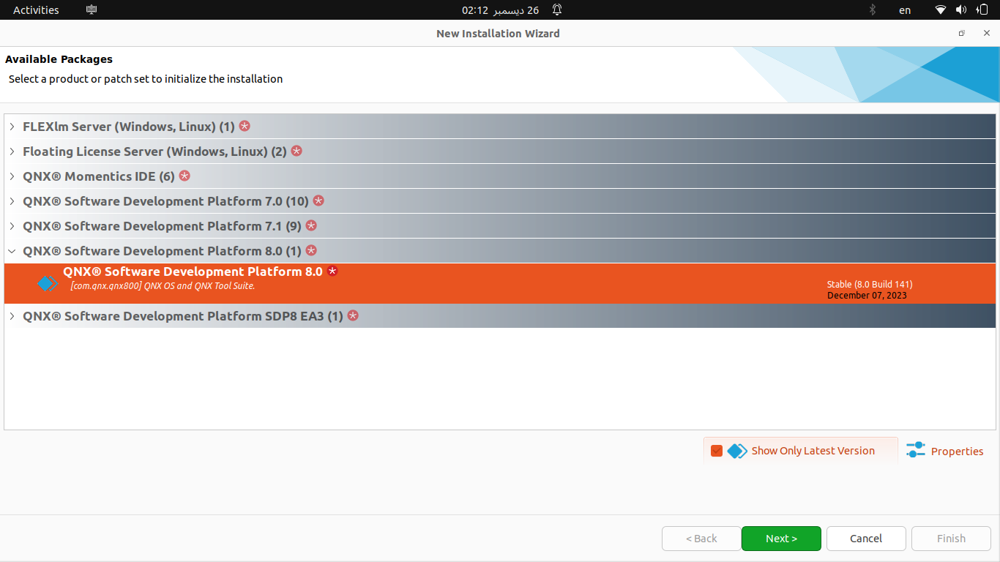

# QNX Academic Version (Non-Commercial)
### 1. QNX Installation

**1.1. Create Your QNX Account from [HERE](https://www.qnx.com/account/login.html?logout=1#showcreate) Then Activate your QNX Account** 

**1.2. Request Free QNX License from [HERE](https://qnx.com/getqnx)** 

**Please follow This Video**  :

https://www.youtube.com/watch?v=DtWA5E-cFCo&t=313s

- **After requesting , If you go to License Manager [HERE](https://www.qnx.com/account/dashboard/)** 


- **You should accept the license and deploy it on your QNX Account [See the above video]**


- **If you go to the registered products in your QNX profile :**


- **Go to the QNX Software Center to download QNX**


- **I use Linux Ubuntu 22.04 LTS, So I will select Linux Host**

- **To install the QNX Software Center on a Linux development host:**

  - Log in to your **myQNX** account on the QNX website, select the Developers tab at the top of the page, then click the QNX Software Center link.

  - Click the link for Linux hosts and download the QNX Software Center installer, 

    `qnx-setup-*nnnnnnnnnnnn*-lin.run` , where *nnnnnnnnnnnn* is a build number.

    

  - To ensure you are running the official installer, verify that the checksum of the downloaded file matches the checksum posted on the QNX website. (This step is required because Linux doesn't support automatic verification of binary signatures.)


- **Run `chmod` to make the installer executable**

```bash
chmod a+x qnx-setup-2.0.3-202408131717-linux.run
```

**1.3. Install Software Development Platform SDP , Version QNX 8.0 for Linux**

- **Run the installer**

  ```bash
  ./qnx-setup-2.0.3-202408131717-linux.run
  ```


- **Add Installation**


- **Select QNX SDP 8.0** then Click Next  :

  


- **Then Press Finish**


- **After Installation DONE **

  


>Software Development Platform (SDP) Version 8.0 of the QNX Software Center installed in **qnx800** directory.  


>The **host** folder is where you will find the tools necessary for building programs on your computer, while the **target** folder contains all of the files that can go on your QNX system (though you will only ever likely need a small subset of these).


To develop Apps on QNX for a particular board, you will need to add the relevant board support package **(BSP)**, which contains the source code and binaries for the specific hardware [in my case **RPI-4**]. 

The SDP provides everything you need in order to build your own QNX system. How-ever, to get you up and running quickly with Raspberry Pi, we will use a pre-defined image that you can just copy to an SD card. 

**1.4. Install QNX SDP 8.0  Image for Raspberry Pi 4**

Open QNX Software Center, and install the **“QNX® SDP 8.0 Quick Start image for Raspberry Pi 4”** package.

- **Open QNX Software Center** :

   `Updates -> QNX Software Development Platform -> Reference Images:`


**Then Press Install**


- **After Rpi4 Image Installed** :


- **When Open qnx800 directory again there is new directory called `images`**


```bash
ls -lh qnx_sdp8.0_rpi4_quickstart_20241216.img
du -h qnx_sdp8.0_rpi4_quickstart_20241216.img 
```

------------------------------------------------------

#### 2. Flash QNX SDP 8.0  Image  for Rpi4 on SD Card

There are two utilities to flash images on SD cards [or any removable device]

**2.1. Raspberry Pi Imager [Option#1]**


- `Operating System ` : choose your Image
- `Storage` : choose your removable device [e.g. SD card]


**2.2. Linux Command Line `dd`  [Option#2]**

```bash
dd if=<Your_Image> of=<device name> bs=4M status=progress
```

- To Know the device name, open the terminal and run : 

  ```bash
  lsblk
  ```

  

In my case the SD card [device name] is `sdc`

```bash
dd if=qnx_sdp8.0_rpi4_quickstart_20241216.img of=/dev/sdc bs=4M status=progress
```


--------------------

Once the image has been copied to the SD card and remains connected to your computer, you should be able to view the files written to the first partition (a FAT partition accessible by any operating system). Within this partition, two files require editing to configure the system:

- The first file, **qnx_config.txt**, does not need modification unless you want to adjust the default hostname (currently **qnxpi**) or specify the destination for console output.

  


- The second file that requires updating is **wpa_supplicant.conf**. At the bottom of this file (following extensive documentation), you’ll find the **network settings** configuration section. Modify the `ssid` field to match your WiFi network name and the `psk` field to your WiFi password. These configurations assume a typical home network using WPA authentication.

  

### 3. Booting the Raspberry Pi 4 

