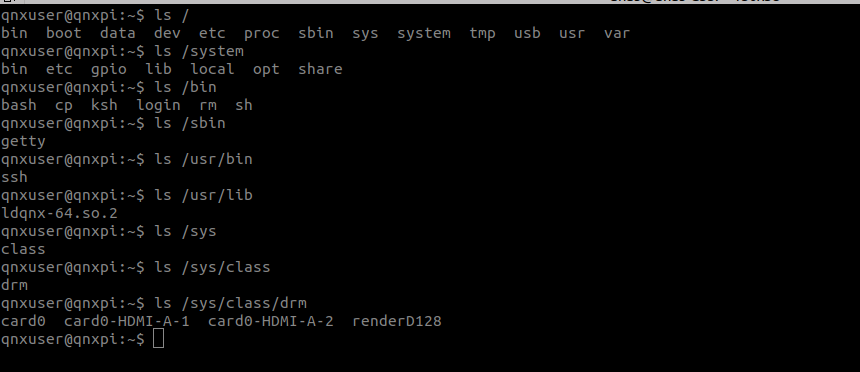
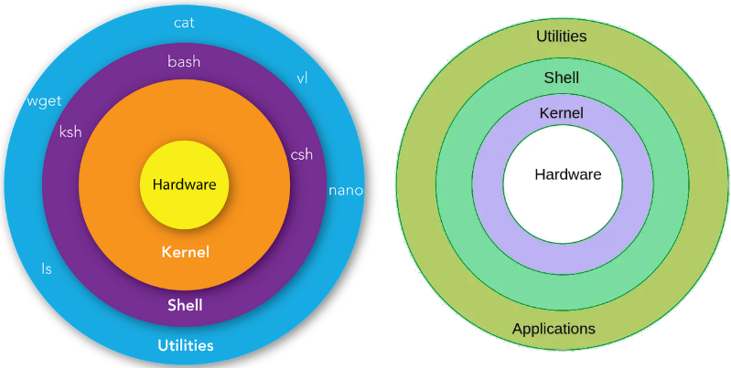
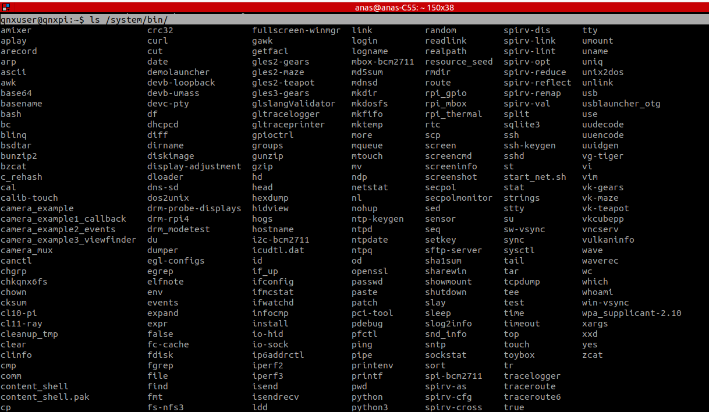
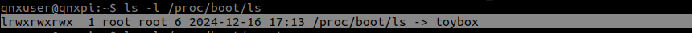
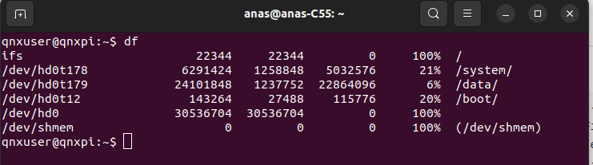

##  QNX File System on RPI4

After connect computer with QNX-RPI via SSH connection, I can play with all QNX files.



### 1.  Shell

A shell is a special user program that provides an interface for the user to use operating system services. Shell accepts human-readable commands from users and converts them into something which the kernel can understand. It is a command language interpreter that executes commands read from input devices such as keyboards or from files. The shell gets started when the user logs in or starts the terminal.






### 1.1. QNX Shell

The default shell on QNX systems is a variant of the **Korn Shell, called pdksh,** but 
QNX Raspberry Pi image uses the more familiar **bash (the Bourne Again Shell)**, which is
the default shell on many modern UNIX systems [like linux].

Unlike typical Linux systems that use **Busybox** shell utility, QNX simplifies this by using **Toybox** :

- A single program that provides most basic UNIX shell utilities (`ls`, `cat`, `cp`, `mv`, etc.).
- Uses symbolic links to determine the command being invoked:
  - For example, when you type `ls`, the system executes the `toybox` binary with a flag telling it to run the `ls` functionality.
- This approach reduces the size of the system image and improves efficiency.



>**`ls` is a symbolic link under /proc/boot to toybox**


### 2. File System

A file system organizes and stores data in a structured way, making it possible for users and programs to access files easily.

- **Structure**:
  - Files are arranged hierarchically in directories (folders).
  - Each file or directory has a **name** and resides at a specific **path**.
- **Storage Mediums**:
  - A file system can exist on various types of storage, such as:
    - Hard drives
    - SD cards
    - Network storage (e.g., NFS, Samba)
    - Volatile memory (RAM disks)
- **Common File Systems**:
  - **FAT**: Legacy file system from Microsoft, compatible with almost all systems.
  - **NTFS**: Advanced file system used in modern Windows.
  - **ext4**: Default Linux file system, designed for performance and reliability.
  - **QNX6 Power-Safe File System**: A proprietary, resilient file system designed for real-time and embedded systems, emphasizing data integrity and fault recovery.

 **2.1. Identifying Files in a File System**

- Every file or directory is uniquely identified by its **path**, a string representing its location within the hierarchy.

  - Example:  File `apple` inside directory `friuts`, which is in `food`:

    ```bash
    food/friuts/apple
    ```

- **Paths**:

  - **Absolute Path**: Starts from the root directory `/` (e.g., `/home/food/friuts/apple`).
  - **Relative Path**: Refers to a file relative to the current directory (e.g., `friuts/apple`).

**2.2. Mounting File Systems**

- **Mounting**: Integrating a file system into the system’s directory hierarchy.
  - A file system is mounted at a specific path, such as `/home`.
  - Once mounted, all files and directories in that file system can be accessed using paths under `/home`.
- Example:  A file system containing  `food/friuts/apple`  is mounted at `/home`.
  - Full path to `apple`: `/home/food/friuts/apple`.

**2.3. Path Space in QNX**

The **path space** is the **hierarchical collection of all paths** (files and directories) in the system.

- **Path Space Concept**:

  - Imagine all the file systems mounted in a system are combined into one giant "tree" of directories.
  - The **root directory** `/` is the top-level entry point.
  - From the root, subdirectories represent mounted file systems and their contents.

- **Example**:

  - Suppose you have these file systems:

    1. A **boot file system** mounted at `/boot`.
    2. A **system file system** mounted at `/system`.
    3. A **data file system** mounted at `/data`.

    Path space will look like this:

    ```bash
    /
    ├── boot/
    │   ├── config.txt
    │   ├── kernel.img
    │   └── ... 
    ├── system/
    │   ├── bin/
    │   ├── lib/
    │   └── etc/
    └── data/
        ├── home/
        │   ├── user1/
        │   ├── user2/
        │   └── ...
        ├── tmp/
        └── var/
    ```

- The **path space** organizes and unifies all these paths into a single accessible hierarchy.

**2.4. Path Manager**

QNX uses a **path manager** in the kernel to manage the path space.

The **path manager** is a **software component in the QNX kernel** that:

- Tracks all mounted file systems.

- Resolves file paths to their corresponding file systems.

- Forwards file access requests to the appropriate **file system server process**.

- Placement:
  - The path manager is part of the **Neutrino microkernel**, specifically within the `procnto` process (short for "process and path manager").
  - It operates as a **kernel-level service**, interacting with user processes and server processes.

**2.4.1. Role of the Path Manager**

The path manager is like a "traffic controller" for file paths.

- **Resolve Paths**:

  - When a program accesses a file using its path (e.g., `/data/home/user1/file.txt`), the path manager determines:
    - Which file system the file belongs to.
    - Which server process manages that file system.

  - Example:
    - File path: `/data/home/user1/file.txt`
    - Mounted at `/data`: A QNX6 file system.
    - The path manager identifies the server process managing `/data` and directs the request there.

- **Coordinate File Operations**:

  It ensures that file-related requests (like `open`, `read`, `write`, `close`) are sent to the correct file system server process.

- **Support Dynamic Mounting**:

The path manager dynamically integrates new file systems into the path space when they are mounted.

- **Enable Modular Design**:
  - Each file system (e.g., `/system`, `/data`) is managed by its own server process. The path manager allows these to work independently but appear unified to applications.

**2.5. Scenario:**

- A process wants to open the file `/data/home/user1/file.txt`.

1. **Path Parsing**:
   - The path manager splits the path: `/`, `data`, `home`, `user1`, `file.txt`.
2. **File System Lookup**:
   - It identifies that the directory `/data` is a mount point for a file system.
   - The path manager forwards the request to the **server process managing `/data`**.
3. **File Handling**:
   - The server process managing `/data` looks for `/home/user1/file.txt` within its file system and performs the requested operation (e.g., `read`).


**2.6.  Why Does QNX Use a Path Manager?**

The path manager in QNX is essential because of the system’s **microkernel architecture**:

1. **Decoupling**:
   - Each file system is managed by a separate server process, not by the kernel itself.
   - This design improves reliability: if one file system fails, it does not crash the kernel.
2. **Unified Interface**:
   - From the user’s perspective, all file systems are seamlessly integrated into one hierarchical structure.
3. **Flexibility**:
   - New file systems can be mounted or unmounted dynamically without affecting the rest of the system.
4. **Efficiency**:
   - The path manager minimizes overhead by delegating operations to specialized file system server processes.

-----------------

**Visual Representation of File System Components:**

```
+------------------+     +---------------------+     +----------------------+
|   Application    | --> |   Path Manager      | --> | File System Server 1 |
| (User Process)   |     | (Kernel Component)  |     | (e.g., /boot)        |
+------------------+     +---------------------+     +----------------------+
                               |
                               +---------------------+
                               | File System Server 2 |
                               | (e.g., /data)        |
                               +---------------------+
```

------

### 3. QNX File System Types

The `df` command displays information about file systems, including:

- **Mounted paths**: Where each file system is attached in the directory structure.
- **Size**: Total and available space.
- **Usage percentage**: How much space is used.




| **File System** | **Size (KB)** | **Used (KB)** | **Available (KB)** | **Use%** | **Mounted At** |
| --------------- | ------------- | ------------- | ------------------ | -------- | -------------- |
| `ifs`           | 22344         | 22344         | 0                  | 100%     | `/`            |
| `/dev/hd0t178`  | 6291424       | 1258848       | 5032576            | 21%      | `/system/`     |
| `/dev/hd0t179`  | 24101848      | 1237752       | 22864096           | 6%       | `/data/`       |
| `/dev/hd0t12`   | 143264        | 27488         | 115776             | 20%      | `/boot/`       |
| `/dev/hd0`      | 30536704      | 30536704      | 0                  | 100%     | (not mounted)  |
| `/dev/shmem`    | 0             | 0             | 0                  | 100%     | `(/dev/shmem)` |

> **Explanation of Columns:**
>
> 1. **File System**: The name or identifier of the file system.
> 2. **Size (KB)**: The total size of the file system in kilobytes.
> 3. **Used (KB)**: The amount of space used in kilobytes.
> 4. **Available (KB)**: The amount of free space in kilobytes.
> 5. **Use%**: Percentage of used space.
> 6. **Mounted At**: The path where the file system is mounted in the directory structure.


#### 3.1. **Image File System (IFS)**

- **What is it?**

  - A **read-only** file system loaded into memory during boot as a primary file system.
  - Contains essential components: startup executable, kernel, drivers, libraries, build scripts and basic utilities.
  - Mounted at **root (`/`) file system**.

- **Purpose**:

  - Provides the minimal infrastructure needed to load and mount other file systems (like `/system` and `/data`).

- **Location**:

  - Most files in the IFS are located under `/proc/boot`.

    ```bash
    ls /proc/boot
    ```

    ```bash
    # Output
    ability                   libz.so.2
    build                     ln
    cam-disk.so               ls
    cat                       mount
    chkqnx6fs                 mount_fs.sh
    chmod                     on
    dd                        pci-server
    devb-sdmmc-bcm2711        pci_bkwd_compat.so
    devc-serminiuart          pci_bkwd_compat.so.3.0
    devu-hcd-bcm2711-xhci.so  pci_cap-0x01.so
    diskimage                 pci_cap-0x01.so.3.0
    echo                      pci_cap-0x05.so
    expandfs.sh               pci_cap-0x05.so.3.0
    fdisk                     pci_cap-0x10.so
    fs-dos.so                 pci_cap-0x10.so.3.0
    fs-qnx6.so                pci_cap-0x11.so
    fsevmgr                   pci_cap-0x11.so.3.0
    getconf                   pci_debug2.so
    getty                     pci_debug2.so.3.0
    grep                      pci_hw-bcm2711-rpi4.so
    io-blk.so                 pci_hw-bcm2711-rpi4.so.3.0
    io-usb-otg                pci_server-buscfg-generic.so
    ksh                       pci_server-buscfg-generic.so.3.0
    ldqnx-64.so.2             pci_server.cfg
    libc.so.6                 pci_slog2.so
    libcam.so.2               pci_slog2.so.3.0
    libcrypto.so.3            pci_strings.so
    libfsnotify.so.1          pci_strings.so.3.0
    libgcc_s.so.1             pidin
    libjail.so.1              procnto-smp-instr
    libjson.so.1              qcrypto-openssl-3.so
    libm.so.3                 qcrypto.conf
    libncursesw.so            rm
    libncursesw.so.1          rtc
    libpci.so.3.0             setconf
    libqcrypto.so.1.0         setfacl
    libqh.so.1                sh
    libregex.so.1             shutdown
    libsecpol.so.1            slog2info
    libslog2.so               slogger2
    libslog2.so.1             startup-script
    libslog2parse.so.1        startup.sh
    libslog2shim.so.1         toybox
    libsocket.so              usb
    libsocket.so.4            usb_start.sh
    libusbdi.so.2             waitfor
    ```

- **Advantages and Disadvantages**:

  - Advantages:
    - Ensures the kernel and critical components are always accessible and unmodifiable.
    - Can be extended to include more executables or libraries for additional functionality.
  - Disadvantages:
    - Larger IFS sizes increase memory usage.
    - Read-only nature means updates require rebuilding the IFS.

------

#### 3.2. **QNX6 File Systems (`/system` and `/data`)**

The **QNX6 File System**, also known as the **Power-Safe File System (fs-qnx6)**, is the default file system used in QNX Neutrino RTOS. It is specifically designed for **reliability**, **data integrity**, and **fault tolerance**, making it well-suited for real-time and embedded systems.

- **Two file systems based on the QNX6 power-safe file system:**

  > The Power-Safe filesystem, supported by the **fs-qnx6.so** shared object, is a reliable disk filesystem that can withstand power failures without losing or corrupting data.
  >
  > - **`/system`**: Typically read-only, used for system binaries, libraries, and configuration files.
  >
  >   ```bash
  >   /system
  >   ├── bin
  >   │   ├── amixer
  >   │   ├── bash
  >   │   ├── cp
  >   │   ├── ls
  >   │   ├── ssh
  >   │   ├── vim
  >   │   ├── shutdown
  >   │   ├── sysctl
  >   │   └── (many more executables)
  >   ├── etc
  >   │   ├── alsa/
  >   │   ├── desktop_files/
  >   │   ├── dhcpcd/
  >   │   ├── firmware/
  >   │   ├── fontconfig/
  >   │   ├── io-sock.conf
  >   │   ├── profile
  >   │   ├── post_startup.sh
  >   │   ├── systemupdate.sh
  >   │   ├── terminfo/
  >   │   └── version.txt
  >   ├── gpio
  >   │   └── led.py
  >   ├── lib
  >   │   ├── dll/
  >   │   ├── engines-3/
  >   │   ├── graphics/
  >   │   ├── libEGL.so
  >   │   ├── libGLESv2.so
  >   │   ├── libjpeg.so
  >   │   ├── libasound.so
  >   │   ├── libpam.so
  >   │   └── (more shared libraries)
  >   ├── local
  >   │   └── (custom local files or folders, currently empty)
  >   ├── opt
  >   │   ├── gpioctrl/
  >   │   │   ├── gpioctrl
  >   │   │   ├── images/
  >   │   │   │   ├── alt.png
  >   │   │   │   ├── background.png
  >   │   │   │   ├── button_on.png
  >   │   │   │   ├── led_on.png
  >   │   │   │   └── (other images)
  >   ├── share
  >   │   ├── fonts/
  >   │   │   ├── DejaVuSans-Bold.ttf
  >   │   │   ├── DejaVuSerif-BoldItalic.ttf
  >   │   │   └── (other DejaVu font files)
  >   │   ├── icu/
  >   │   ├── keyboard/
  >   │   │   ├── en_US_101.kbd
  >   │   │   ├── fr_FR_102.kbd
  >   │   │   ├── symbols.inc
  >   │   │   └── (keyboard layout files)
  >   │   ├── screen/
  >   │   │   ├── graphics-headless.conf
  >   │   │   └── graphics-virtual-display.conf
  >   │   ├── vim/
  >   │   │   └── vim91/
  >   │   │       ├── autoload/
  >   │   │       ├── colors/
  >   │   │       ├── doc/
  >   │   │       ├── syntax/
  >   │   │       │   ├── python.vim
  >   │   │       │   ├── html.vim
  >   │   │       │   └── (other language syntax files)
  >   │   │       ├── tutor/
  >   │   │       │   ├── tutor.fr
  >   │   │       │   ├── tutor.zh
  >   │   │       │   └── (multi-language Vim tutorials)
  >   │   │       └── (other Vim-related subdirectories)
  >   
  >   ```
  >
  >   The `/system` directory is primarily designed to host:
  >
  >   1. **System Binaries**:
  >      - Executable files that provide basic system functionality (e.g., `ls`, `cp`, `ssh`).
  >   2. **Shared Libraries**:
  >      - Essential libraries (`.so` files) that support system binaries and applications.
  >   3. **Configuration Files**:
  >      - System-wide settings, such as networking, device configurations, and user profiles.
  >   4. **Optional Software**:
  >      - Additional tools or applications that are not critical but enhance functionality.
  >   5. **Shared Resources**:
  >      - Fonts, keyboard layouts, Vim editor plugins, and other shared files for system-wide use.
  >
  >   ---------------------------
  >
  > - **`/data`**: Writable, used for user files, logs, temporary files, and runtime data.
  >
  >   ```bash
  >   /data
  >   ├── home
  >   │   ├── qnxuser
  >   │   │   ├── bin
  >   │   │   ├── homepage
  >   │   │   │   ├── bootstrap.bundle.min.js
  >   │   │   │   ├── bootstrap_license.txt
  >   │   │   │   ├── bootstrap.min.css
  >   │   │   │   ├── cityscape.png
  >   │   │   │   └── index.html
  >   │   │   ├── lib
  >   │   │   │   └── dll
  >   │   │   └── log.txt
  >   │   ├── root
  >   │   ├── user1
  >   │   ├── user2
  >   │   ├── user3
  >   │   ├── user4
  >   │   ├── user5
  >   │   └── user6
  >   └── var
  >   ```
  >
  >   1. **`/data/home/`**:
  >      - Contains home directories for multiple users: `qnxuser`, `root`, `user1`, etc.
  >      - Each user directory stores personal files and configurations.
  >      - Example:
  >        - **`qnxuser/homepage/`**: Contains web resources (e.g., HTML, CSS, JS files).
  >        - **`qnxuser/lib/`**:  contain user-specific libraries or dependencies.
  >   2. **`/data/var/`**:
  >      -  Used for runtime data (e.g., logs, temporary files, or caches).
  >
  > **Purpose of Separation between `/system` and `/data`** :
  >
  > - Protect the system partition(`/system`):
  >   - Can be mounted as read-only to prevent accidental or malicious modification.
  >   - Suitable for adding encryption or verification mechanisms.
  > - Provide writable storage (`/data`):
  >   - Allows applications and users to store and modify files without affecting the system partition.

  -----------------------------

- **Features of QNX6 File System**

  1. **Power-Safe Design**:
     - It ensures that the file system remains consistent even after unexpected events like power failures or system crashes.
     - It uses a **transactional model** for updates, meaning file system changes are grouped into transactions that are either fully committed or not applied at all (atomicity).
  2. **Scalability**:
     - Supports large storage capacities and file sizes.
     - Can handle large numbers of files and directories efficiently.
  3. **POSIX Compliance**:
     - Compatible with the POSIX standard, allowing it to support standard file system operations like reading, writing, and metadata manipulation.
  4. **Metadata Journaling**:
     - The file system journals metadata changes to ensure consistency without needing a lengthy filesystem check (`fsck`) after a power failure.
  5. **High Performance**:
     - Optimized for fast file operations, particularly in embedded systems where performance is critical.
  6. **Dynamic Mounting**:
     - QNX6 file systems can be mounted or unmounted dynamically, allowing for flexibility in resource management.

  ------------------------

- **Advantages of QNX6 File System**

  1. **Data Integrity**:
     - The use of journaling ensures that the file system remains in a valid state, even after unexpected shutdowns.
  2. **Low Maintenance**:
     - The system avoids time-consuming file system checks (`fsck`) because of its journaling and transactional nature.
  3. **Fault Tolerance**:
     - Designed to recover gracefully from hardware or power failures, making it ideal for safety-critical applications.
  4. **Read-Only and Writable Mounting**:
     - Parts of the file system (e.g., `/system`) can be mounted as read-only to protect critical files, while other parts (e.g., `/data`) can remain writable for dynamic storage.

- **Structure of QNX6 File System**

  - Similar to UNIX-like systems, QNX6 file systems organize data hierarchically with files and directories.
  - Examples of directories in a QNX6 file system:
    - `/system/bin`: System executables.
    - `/system/lib`: Shared libraries.
    - `/data/home`: User home directories.

  

- **Comparison with Other File Systems**

  | **Feature**                  | **QNX6 File System**        | **ext4 (Linux)**       | **NTFS (Windows)**      |
  | ---------------------------- | --------------------------- | ---------------------- | ----------------------- |
  | **Power-Safe Design**        | Yes (transactional updates) | No (uses journaling)   | No (journaling)         |
  | **POSIX Compliance**         | Fully compliant             | Fully compliant        | Partially compliant     |
  | **Optimized for RTOS**       | Yes                         | General-purpose        | General-purpose         |
  | **File System Check (fsck)** | Not required                | Required after failure | Required after failure  |
  | **Primary Use Case**         | Real-time, embedded systems | General-purpose Linux  | General-purpose Windows |

----------------------

#### 3.3.  **FAT File System (`/boot`)**

- **What is it?**
  - A **FAT** file system used by the Raspberry Pi firmware to boot the system.
  - Contains bootloader files and configuration files (e.g., `qnx_config.txt`).
- **Purpose**:
  - Allows you to configure network settings (like WiFi) or system behavior before the system boots.

------

#### 3.4. **Shared Memory (`/dev/shmem`)**

Shared memory is a mechanism that allows multiple processes to access the same region of memory, enabling them to communicate and exchange data more efficiently than through other methods like message passing.

- **`/dev/shmem` Path**:
  This is the directory where shared memory objects appear in QNX. When processes create shared memory regions, these regions can be represented as files in this directory.

- **In-Memory Files**:
  Files created or written to under `/dev/shmem` are stored in memory [RAM], not on disk. These are temporary files that are kept only as long as the system is running or until the file is removed. When the system is shut down, any files in `/dev/shmem` are lost (because they were never stored on permanent storage).

- **Not a Full File System**:
  While `/dev/shmem` may look like a directory, it is not a full file system (like `/home` or `/etc`). It cannot perform all the operations that you might expect from a regular file system. For instance, operations like `mkdir` (creating a new directory) will fail in `/dev/shmem`.

- **Limitations**:
  Since it is not a full file system, you cannot perform certain file system operations like creating directories. The shared memory objects here are simple files that hold data in memory, so you should not treat `/dev/shmem` as a place to store files the same way you would use other parts of the system's file structure.

**Practical Use Case:**

In practice, `/dev/shmem` is used by applications that need to share data between processes. Instead of writing this data to disk, it resides in memory, offering faster read and write access. However, because the data is not persistent and is cleared when the system shuts down, it's unsuitable for permanent storage.

---------------------------------------------------

#### **3.5 Why QNX uses different  File System layout [unlike linux]?**

- **Traditional Paths (`/bin`, `/usr/lib`) in Linux Vs QNX Layout**

  - Traditional systems [linux] often use paths like `/bin` and `/usr/lib` directly under the root.

  - QNX chooses a different layout for these reasons:
    - **Security:** Separating `/system` and `/data` protects system files from accidental changes or malicious attacks.
    - **Union Path Issues:**
      - Union paths allow multiple file systems to provide files under the same path.
      - Example: Two file systems both provide `/etc`, this can lead to:
        - **Path Confusion**: It’s unclear which `/etc/passwd` file is being accessed.
        - **Security Risks**: Malicious programs might exploit path ambiguity to access or override critical files.

- **Union Paths** 

  It is a feature in QNX (and some other operating systems) that allows multiple file systems to provide content for the same path. This feature is useful but introduces complexities in how paths are resolved and accessed.

  

  - **Multiple File Systems Providing the Same Path**:

    - **Union paths** allow two or more file systems to contribute files and directories to the same path in the file system hierarchy. This means that multiple file systems can be "stacked" over each other, so when you access a path (e.g., `/etc`), you could be getting files from more than one file system.

    - For example, you could have two file systems mounted under `/` (the root directory):
      - **IFS (Image File System)**:  read-only file system.
      - **QNX6 File System**: writable file system.

  - Both can provide files for the `/etc` directory. The result is that the `/etc` directory on the system might appear as a combination of files from both file systems.

  - **How File Resolution Works**:

    >**File resolution** refers to the process by which an operating system determines **which file** to access when multiple files exist with the same name, or when multiple file systems provide the same path. It involves **resolving** or deciding which specific file or directory should be used in a given context.

    - If a directory (like `/etc`) exists in both file systems, the content visible in that directory is a **mix** of files from both file systems.

    - If both file systems have a file with the same name (e.g., `/etc/passwd`), the version that is accessible to the user depends on which file system is mounted first (or, in some cases, the mount order). The file system mounted at the front will provide the version of the file that is visible to applications.
      - If the IFS is mounted before the QNX6 file system, then `/etc/passwd` from the IFS will be visible.
      - If the QNX6 file system is mounted before the IFS, then `/etc/passwd` from QNX6 will be visible.

  - **Use Cases**:

    - **Read-only file system updates**: One practical use for union paths is updating a **read-only file system**. If a part of the file system is read-only (e.g., the system root or system libraries), you can mount a **patch file system** on top of it. This patch file system can provide updates or changes without modifying the underlying read-only file system.
    - In this case, if you mount a new file system that provides an updated `/etc/passwd`, and it's mounted on top of an older system, then any references to `/etc/passwd` will access the new version from the patch file system, not the old version from the underlying system.

  - **Challenges and Risks**:

    - **Path Resolution Complexity**: When multiple file systems provide the same path, resolving which file or directory is "correct" can become tricky. If you're not careful with mounting order and file system configurations, you might not always get the file you expect when accessing a path like `/etc`.
    - **Potential Confusion**: Users or applications could be confused when they expect a certain file to come from a specific file system, but they are unknowingly accessing a file from a different file system mounted at a higher level.
    - **Security Risk**: In **malicious circumstances**, an attacker could exploit union paths to hide malicious files behind legitimate files. For example, an attacker could mount a file system with a compromised `/etc/passwd` and mount it on top of a legitimate file system, potentially tricking a program into opening the malicious version of a critical file.

    

- **QNX File system drawbacks:**

  - Complicates path resolution.
  - Introduces performance overhead.

- **Benefits of the QNX Layout** :

  - **Enhanced Protection:** `/system` can be made read-only, shielding critical binaries and libraries.

  - **Writable Storage:** `/data` remains writable for user and runtime files.

  - **Modularity:** new file systems can be added or removed dynamically without affecting others.

  - **Security:** Avoids ambiguity and vulnerabilities introduced by union paths.

------------------

#### 3.6. How Files Are Accessed

- Accessing `/data/home/user1/myfile.txt`:
  1. Path manager resolves `/data` as the mount point for a QNX6 file system.
  2. The file system server responsible for `/data` handles the request.
- Accessing `/boot/config.txt`:
  1. Path manager resolves `/boot` as the mount point for the FAT file system.
  2. The FAT file system server handles the request.

------
