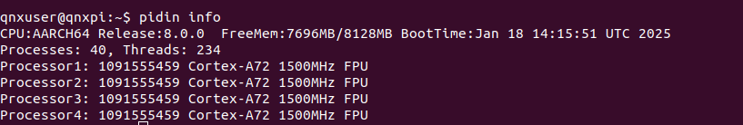
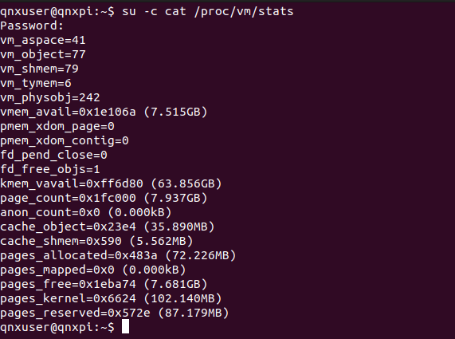
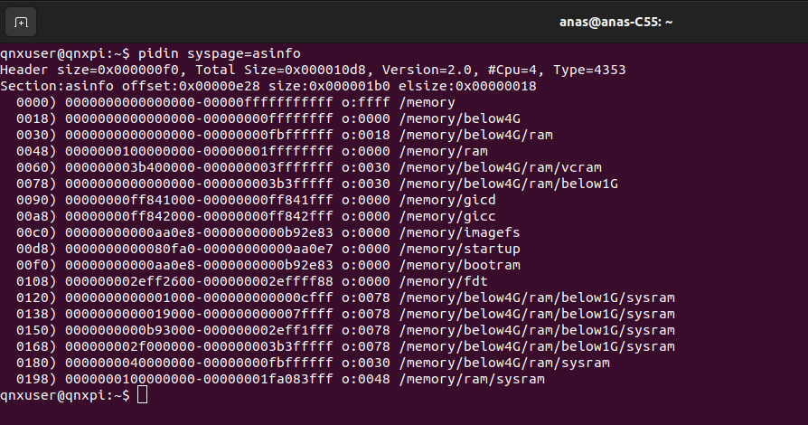
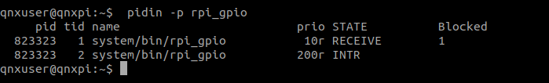
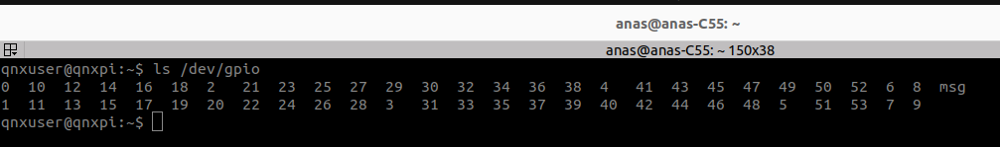
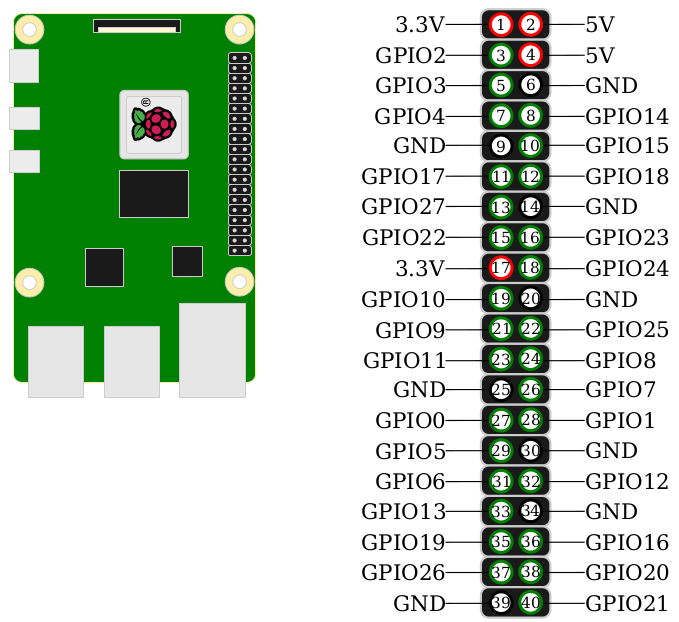
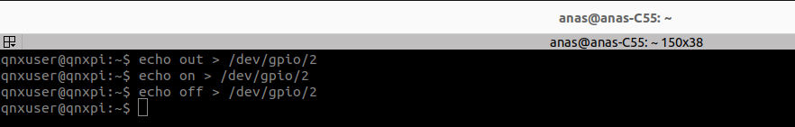

# Exploring QNX System
### 1. Processes

A **process** in QNX is a running instance of a program, similar to processes in other operating systems. However, QNX's microkernel architecture makes its process model unique compared to traditional monolithic kernels like those in Linux.

#### 1.1. **Characteristics of QNX Processes**

- **Microkernel Architecture**:

  - The core functionality (e.g., memory management, process management, path resolution) is minimal and resides in the **microkernel**.

  - Most system-level functionality (e.g., file systems, networking, drivers) is implemented as **stand-alone processes** in user space. This design isolates services, improving fault tolerance.

- **Process Structure**:

  - Each process consists of:
    - **Threads**: Streams of execution within the process. Threads share the process's resources (e.g., memory, file descriptors).
    - **Address Space**: Virtual memory space unique to the process.

  - Processes communicate with each other via **Inter-Process Communication (IPC)**, managed by the **microkernel**.

- **First Process: `procnto-smp-instr`**:

  - The **first process** created when the system starts.

  - Hosts the Neutrino microkernel and provides basic system services:
    - **Process Manager**: Handles process creation and management.
    - **Memory Manager**: Manages virtual memory.
    - **Path Manager**: Resolves pathnames and links them to the appropriate servers or resources.

  - This process is critical for the system's operation.

- **Types of Processes**: QNX systems typically consist of three types of processes:

  - **Kernel Processes**: Provide core system functionality (e.g., procnto-smp-instr).

  - **System Services**: User-space processes that implement functionality typically found in a monolithic kernel:
    - File systems
    - Networking (TCP/IP stack)
    - USB
    - Graphics drivers
    - Audio

  - **Application Processes**: Implement specific user-facing or system-specific functionality:
    - Shell, editors, compilers and utilities. 
    - Media players, browsers (for interactive systems)
    - Controllers, monitors (for embedded systems in automotive, industrial, or medical use cases)

- **Customization**:

  - A QNX system can be customized to include only the processes necessary for its intended function:

    - A **headless system** (no display or GUI) may exclude graphics processes.

    - A **simple controller** may omit a permanent file system.

      >In some embedded systems, such as those used in industrial control, automotive, or simple IoT devices, the system may not require the traditional **file system** (like the ones you see on your computer: NTFS, ext4, FAT32)


#### 1.2.  **Process Management**

- **Process Creation**:

  - Processes are created by the **process manager** in the kernel.

  - Applications or system services can spawn new processes as needed.

- **Listing Processes and Threads**:

  - The `pidin` command lists all processes and their threads in a running QNX system.

  - Each process is identified by a unique **process ID (PID)**.

  ```bash
  pidin
  ```

  ```bash
  	  # The Output (truncated output)
        
        pid tid name                         prio STATE          Blocked                     
         1   1 /proc/boot/procnto-smp-instr   0f RUNNING                                    
         1   2 /proc/boot/procnto-smp-instr   0f RUNNING                                    
         1   3 /proc/boot/procnto-smp-instr   0f READY                                      
         1   4 /proc/boot/procnto-smp-instr   0f READY                                                                   
         1  11 /proc/boot/procnto-smp-instr 254i INTR                                       
         1  12 /proc/boot/procnto-smp-instr 254i INTR                                       
         1  13 /proc/boot/procnto-smp-instr   1f NANOSLEEP                                  
         1  15 /proc/boot/procnto-smp-instr  10r RECEIVE        1                               
         1  21 /proc/boot/procnto-smp-instr  10r RECEIVE        1                           
         1  22 /proc/boot/procnto-smp-instr  10r RECEIVE        1                           
         1  23 /proc/boot/procnto-smp-instr  10r RECEIVE        1                           
         1  24 /proc/boot/procnto-smp-instr  10r RECEIVE        1                           
         1  26 /proc/boot/procnto-smp-instr  10r RECEIVE        1                           
         1  27 /proc/boot/procnto-smp-instr  10r RUNNING                                    
     12291   1 proc/boot/slogger2            10r RECEIVE        1                           
     24580   1 proc/boot/devc-serminiuart    10r RECEIVE        1                           
     24580   2 proc/boot/devc-serminiuart   254i INTR                                       
     32774   1 proc/boot/ksh                 10r REPLY          24580                       
     36869   1 proc/boot/pci-server          10r RECEIVE        1                           
     36869   2 proc/boot/pci-server          10r RECEIVE        1                           
     36869   3 proc/boot/pci-server          10r RECEIVE        1                           
     36869   4 proc/boot/pci-server          10r RECEIVE        1                           
     57351   1 proc/boot/fsevmgr             10r SIGWAITINFO                                
     57351   2 proc/boot/fsevmgr             10r RECEIVE        1                           
     57351   3 proc/boot/fsevmgr             10r RECEIVE        2                              
    241677  20 system/bin/io-sock            10r CONDVAR        (0x0)                       
    241677  21 system/bin/io-sock            10r CONDVAR        (0x0)                       
    241677  22 system/bin/io-sock            10r CONDVAR        (0x0)                       
    241677  23 system/bin/io-sock            10r CONDVAR        (0x0)                       
    241677  24 system/bin/io-sock            10r CONDVAR        (0x0)                       
    241677  25 system/bin/io-sock            21r SEM            0                           
    241677  26 system/bin/io-sock            10r CONDVAR        (0x0)                       
    241677  27 system/bin/io-sock            10r CONDVAR        (0x0)                       
    241677  28 system/bin/io-sock            21r RECEIVE        6                           
    241677  29 system/bin/io-sock            21r RECEIVE        7                           
    241677  30 system/bin/io-sock            10r RECEIVE        8                           
    241677  31 system/bin/io-sock            10r RECEIVE        1                           
    241677  32 system/bin/io-sock            10r RECEIVE        1                           
    241677  33 system/bin/io-sock            10r RECEIVE        1                       
  ```

  >**Understanding the Columns** 
  >
  >1. **`pid` (Process ID):**
  >   - The unique identifier for each process running on the system.
  >   - For example, `1` is the `pid` of the `/proc/boot/procnto-smp-instr` process.
  >2. **`tid` (Thread ID):**
  >   - The unique identifier for each thread within a process.
  >   - A process can have multiple threads, and each thread has a `tid`.
  >3. **`name`:**
  >   - The name of the process or the path to the program.
  >   - For example, `/proc/boot/procnto-smp-instr` is the microkernel process.
  >4. **`prio` (Priority):**
  >   - The scheduling priority of the thread.
  >   - Lower values indicate higher priority, and higher values indicate lower priority.
  >   - The suffix (e.g., `f`, `r`, or `i`) indicates special states:
  >     - `f`: FIFO scheduling (fixed priority).
  >     - `r`: Round-robin scheduling.
  >     - `i`: Interrupt handler.
  >5. **`STATE`:**
  >   - The current state of the thread:
  >     - `RUNNING`: The thread is executing on the CPU.
  >     - `READY`: The thread is ready to run but waiting for the CPU.
  >     - `RECEIVE`: The thread is waiting to receive a message.
  >     - `REPLY`: The thread is waiting for a reply to a sent message.
  >     - `NANOSLEEP`: The thread is sleeping for a short period.
  >     - `SIGWAITINFO`: The thread is waiting for a signal.
  >     - `CONDVAR`: The thread is waiting on a condition variable.
  >     - `SEM`: The thread is waiting on a semaphore.
  >6. **`Blocked`:**
  >   - If the thread is in a blocked state (e.g., `RECEIVE`, `REPLY`, or `CONDVAR`), this column shows the reason or the object it is waiting on:
  >     - `1`: Waiting for a specific process or thread.
  >     - `(0x0)`: Waiting on a memory object or condition variable.

- **States of Processes**:

  - **READY**: Process is ready to execute.
  - **BLOCKED**: Waiting for an event or resource.
  - **RUNNING**: Actively executing on the CPU.

- **Examples**

>#### **Line:**
>
>```bash
>1   1 /proc/boot/procnto-smp-instr   0f RUNNING
>```
>
>- `pid`: `1` → Process ID of the microkernel (`/proc/boot/procnto-smp-instr`).
>- `tid`: `1` → First thread of this process.
>- `name`: `/proc/boot/procnto-smp-instr` → Name of the microkernel process.
>- `prio`: `0f` → Fixed-priority thread (`f` = FIFO scheduling).
>- `STATE`: `RUNNING` → The thread is actively running.
>
>#### **Line:**
>
>```
>1  13 /proc/boot/procnto-smp-instr   1f NANOSLEEP
>```
>
>- `pid`: `1` → Microkernel process.
>- `tid`: `13` → Thread within the microkernel.
>- `prio`: `1f` → FIFO scheduling with priority `1`.
>- `STATE`: `NANOSLEEP` → The thread is temporarily sleeping.
>
>#### **Line:**
>
>```bash
>24580   1 proc/boot/devc-serminiuart    10r RECEIVE        1
>```
>
>- `pid`: `24580` → Process ID of the `devc-serminiuart` device driver.
>- `tid`: `1` → Main thread of this process.
>- `prio`: `10r` → Round-robin scheduling with priority `10`.
>- `STATE`: `RECEIVE` → Waiting to receive a message.
>- `Blocked`: `1` → Waiting for a message from process `1` (likely the microkernel).
>
>#### **Line:**
>
>```bash
>241677  20 system/bin/io-sock            10r CONDVAR        (0x0)
>```
>
>- `pid`: `241677` → Process ID of the `io-sock` process.
>- `tid`: `20` → Thread within this process.
>- `prio`: `10r` → Round-robin scheduling with priority `10`.
>- `STATE`: `CONDVAR` → Waiting on a condition variable.
>- `Blocked`: `(0x0)` → Waiting on a condition variable object at memory location `0x0`.
>
>--------------------------

- **Microkernel (procnto-smp-instr):**

  - `pid` = `1` → This is the main process hosting the QNX Neutrino microkernel.

  - Has multiple threads handling different tasks, such as:
    - Interrupts (`INTR`).
    - Message passing (`RECEIVE`).
    - Timing operations (`NANOSLEEP`).

- **Device Drivers:**

  - Processes like `devc-serminiuart` represent device drivers for serial communication.

  - They often wait in the `RECEIVE` state, ready to handle hardware or kernel messages.

- **System Services:**

  - Processes like `slogger2` handle logging.

  - Often blocked in states like `RECEIVE`, waiting for messages or signals from other processes.

- **Application Threads:**
  - Threads in the `io-sock` process are waiting on condition variables or semaphores for events like socket I/O.

-------------------

**Example**

```
692246   3 proc/boot/io-usb-otg          10r CONDVAR        (0x0)
```

1. **`pid` (Process ID):**
   - `692246`: This is the unique ID of the process running the `io-usb-otg` executable.
   - The `io-usb-otg` process is the USB On-The-Go (OTG) service, responsible for USB device handling.
2. **`tid` (Thread ID):**
   - `3`: The thread ID within the `io-usb-otg` process. This is the third thread of the process.
3. **`name`:**
   - `proc/boot/io-usb-otg`: The executable name or path for the USB OTG service.
4. **`prio` (Priority):**
   - `10`: The thread’s scheduling priority is 10.
   - Lower-priority numbers represent higher-priority threads. A value of `10` indicates a moderate priority.
5. **`STATE`:**
   - `CONDVAR`: The thread is currently blocked and waiting on a **condition variable**.
   - A condition variable is a synchronization primitive used to coordinate thread execution. The thread is likely waiting for a signal or notification from another thread to proceed.
6. **`Blocked`:**
   - `(0x0)`: Indicates the thread is waiting on a condition variable located at virtual address `0x0`.
   - Normally, the address here corresponds to the location of the condition variable in memory.
   - In your case, `0x0` means:
     - Either the condition variable hasn’t been properly initialized.
     - Or, it is waiting for a generic synchronization object not tied to a specific address.


### 2. QNX Memory 

RAM, is a shared resource that every process requires like the CPU. All processes compete with each other for use of memory. The operating system ensures that all processes get access to RAM without conflicts. This involves dividing the available memory among the processes.

- **Physical Memory**

  - The total amount of RAM available in the system.

  - Physical memory is divided into pages, typically 4 KB in size, which can be allocated to processes as needed.

- **Virtual Memory**

  - Each process has its own private virtual address space.

  - The virtual address space is split into:
    - **User space:** For application code, heap, stack, and libraries.
    - **Kernel space:** Reserved for system-level operations.

- **Shared Memory**

  - QNX supports **shared memory** to allow processes to communicate efficiently by accessing the same memory region.

  - Commonly used for **Inter-Process Communication (IPC)**.

- **Memory Pools**
  - QNX divides memory into pools:
    - **System Memory Pool:** Used by the kernel and system services.
    - **User Memory Pool:** Allocated for user processes.

**2.1. Memory Management in QNX**

- **Virtual Memory Manager (VMM):** QNX uses a Virtual Memory Manager to handle memory allocation and manage RAM effectively. The VMM ensures that each process gets its own isolated memory space and can interact with memory safely.

- **Procnto-smp-instr Process:**

  This is a special process in QNX that combines the **microkernel** with several essential services, including the virtual memory manager.

  

**2.2. How Memory Management Works**

1. **Virtual Memory:** Each process is given a **virtual address space**, which abstracts the physical RAM. This allows processes to behave as though they have their own dedicated memory.
2. **Memory Isolation:** Processes are isolated from one another, meaning one process cannot accidentally overwrite another's memory. This isolation is critical for system stability and security.
3. **Dynamic Allocation:** The VMM allocates and deallocates memory as processes start, run, and terminate. This ensures that memory is used efficiently.
4. **Shared Resources:** For shared resources or communication, the system allows controlled sharing of memory regions between processes using mechanisms like shared memory or IPC (Inter-Process Communication).

### 

**2.3. Memory Issues**

Running out of memory is a critical issue in any system, including QNX on a Raspberry Pi, where hardware resources are limited. This can occur due to misbehaving processes, poor system design, or a failure to account for the memory requirements of the software. So, there are two important questions

**2.3.1. How much memory does my system use ?**

We can run `pidin info`  in the QNX terminal to know

```bash
pidin info
```



>**1. `CPU:AARCH64 Release:8.0.0 FreeMem:7696MB/8128MB BootTime:Jan 18 14:15:51 UTC 2025`**
>
>- **`CPU:AARCH64`**
>  - Indicates the CPU architecture. `AARCH64` refers to the 64-bit ARM architecture, which is common for Raspberry Pi 4 and similar devices.
>- **`Release:8.0.0`**
>  - Refers to the version of the QNX operating system running on the device, in this case, version 8.0.0.
>- **`FreeMem:7696MB/8128MB`**
>  - Displays the amount of free and total memory available:
>    - The system has 8GB of RAM (depending on RPI 4 model, yours
>      may have  2GB, 4GB or 8GB),
>    - **FreeMem:** 7696 MB of RAM is currently available.
>    - **Total Memory:** 8128 MB of total RAM is present in the system.
>    - This shows that the system is using approximately **432 MB of RAM**.
>- **`BootTime:Jan 18 14:15:51 UTC 2025`**
>  - Indicates the date and time when the system was booted.
>
>-------------------
>
>**2. `Processes: 40, Threads: 234`**
>
>- **`Processes: 40`**
>  - The number of processes currently running on the system. Processes are independent programs or tasks.
>- **`Threads: 234`**
>  - The total number of threads across all running processes. Threads are smaller execution units within processes, and each process can have multiple threads performing different tasks concurrently.
>
>---------------------------------------------------------------------------------------
>
>**3. `Processor1: 1091555459 Cortex-A72 1500MHz FPU`**
>
>- **`Processor1`**
>  - Refers to the first processor core (Core 1).
>- **`1091555459`**
>  - This is likely a unique identifier or processor ID used internally by QNX or ARM to identify the processor.
>- **`Cortex-A72`**
>  - Indicates the specific processor model. Cortex-A72 is a high-performance ARM processor used in the Raspberry Pi 4.
>- **`1500MHz`**
>  - The clock speed of the processor, which is 1500 MHz (1.5 GHz). This determines how fast the processor can execute instructions.
>- **`FPU`**
>  - Refers to the presence of a **Floating Point Unit**, which is a specialized processor for handling arithmetic calculations involving floating-point numbers. This is important for performance in tasks like scientific calculations, graphics processing, and signal processing.
>
>----------------------
>
>**4. Similar Lines for `Processor2`, `Processor3`, and `Processor4`**
>
>- The same details are repeated for the other three cores of the Raspberry Pi 4's quad-core ARM Cortex-A72 CPU. Each core runs independently at the same clock speed (1500 MHz) and has an FPU for floating-point operations.

------------------

> **Note That :** The QNX memory manager **may not have access to all of the RAM on a board** if certain factors limit its availability. 
>
> **Factors Affecting Available RAM** :
>
> 1. **Boot-Time Services**
>    - Some system services or configurations at boot time can reserve portions of RAM for their exclusive use.
>    - For example:
>      - **Firmware/BIOS:** Some RAM might be reserved for hardware initialization or runtime services.
>      - **Bootloader:** Certain memory regions may be reserved by the bootloader for its operations or passed to the OS as restricted.
> 2. **Hypervisors**
>    - If QNX is running as a guest OS under a hypervisor (e.g., in a virtualized environment), the hypervisor might allocate only a subset of the physical RAM to QNX.
>    - This allocation is typically defined by the hypervisor configuration and may be shared with other virtual machines.
> 3. **Hardware Reservations**
>    - Some hardware devices reserve portions of RAM for their own use.
>      - Examples:
>        - GPU: Graphics processing units may allocate memory for video buffers.
>        - DMA Buffers: Devices using Direct Memory Access (DMA) might lock certain RAM regions.
>      - On boards like the Raspberry Pi, part of the RAM is often reserved for the GPU by default.
> 4. **System Configuration and Memory Maps**
>    - The memory map provided to the QNX system at boot time defines which portions of RAM are available for use.
>    - If parts of RAM are marked as **reserved** or excluded in the memory map, the QNX memory manager will not use them.
> 5. **OS-Level Constraints**
>    - QNX may exclude certain RAM regions for its own internal purposes:
>      - **Reserved Memory Pools:** Memory reserved for specific applications or kernel services.
>      - **Real-Time Constraints:** Memory may be preallocated or locked for real-time applications to guarantee predictability.
> 6. **Defective or Faulty Memory**
>    - If a portion of RAM is identified as defective (e.g., during power-on self-test or diagnostics), it may be excluded to prevent system instability.

- Also, you can see this file `/proc/vm/stats pseudo-file` but with root permission

```bash
su -c cat /proc/vm/stats
```



>**1. `vm_aspace=41`**
>
>- The number of **address spaces** currently in use.
>- Number of address spaces of active processes.
>
>- Address spaces are isolated memory regions allocated to different processes or entities.
>
>**2. `vm_object=77`**
>
>- The total number of **memory objects** in use.
>- A memory object represents a region of memory allocated to a process or used for shared memory, files, or anonymous memory.
>
>**3. `vm_shmem=79`**
>
>- The number of **shared memory objects** in use.
>- Shared memory is a mechanism for processes to share data efficiently.
>
>**4. `vm_tymem=6`**
>
>- The number of **typed memory regions** in use.
>- Typed memory is reserved for special uses like hardware access or specific real-time applications.
>
>**5. `vm_physobj=242`**
>
>- The total number of **physical memory objects** in use.
>- These objects directly map to physical memory pages and may represent allocated memory or buffers.
>
>**6. `vmem_avail=0x1e106a (7.515GB)`**
>
>- The total available virtual memory for the system.
>- **7.515 GB** of virtual memory is currently free (available).
>
>**7. `pmem_xdom_page=0`**
>
>- The number of **cross-domain pages** in use.
>- Cross-domain pages are memory pages shared between different security or isolation domains. A value of `0` indicates none are in use.
>
>**8. `pmem_xdom_contig=0`**
>
>- The number of **cross-domain contiguous memory allocations**.
>
>- Contiguous memory is required for certain hardware operations, and this value shows none are currently allocated.
>
>  >**Applications Requiring Contiguous Memory** :
>  >
>  >1. **Hardware Drivers**
>  >   - **Device Buffers:** Many hardware devices (e.g., GPUs, network cards, and video capture devices) require contiguous memory for DMA (Direct Memory Access) operations.
>  >   - **Reason:** DMA engines access physical memory directly, and they cannot handle fragmented memory because fragmented memory would require additional address translation logic.
>  >2. **Multimedia Applications**
>  >   - **Video Decoding/Encoding:** Applications that process video streams often require large contiguous memory buffers to store frames.
>  >   - **Reason:** Efficient frame processing and manipulation require linear access patterns, which fragmented memory cannot provide.
>  >3. **Real-Time Systems**
>  >   - **Low Latency Requirements:** Real-time systems often require deterministic memory access times, which contiguous memory guarantees.
>  >   - **Reason:** Fragmented memory introduces overhead due to additional memory lookups or page table accesses, which could disrupt timing constraints.
>  >4. **Embedded Systems**
>  >   - **Tightly Coupled Memory (TCM):** Many embedded systems use TCM or other specialized memory regions that are inherently contiguous.
>  >   - **Reason:** These memory regions are optimized for predictable, low-latency access.
>  >5. **Graphics Applications**
>  >   - **Frame Buffers:** Graphics systems require contiguous memory for frame buffers to ensure smooth rendering and display.
>  >   - **Reason:** Fragmentation would disrupt sequential access patterns needed for rendering.
>  >6. **High-Performance Computing (HPC)**
>  >   - **Large Data Buffers:** HPC applications often allocate massive arrays or data buffers in memory.
>  >   - **Reason:** Contiguous memory ensures data locality and avoids cache misses or inefficiencies caused by scattered memory.
>  >
>  >
>
>**9. `fd_pend_close=0`**
>
>- The number of **pending file descriptor closures**.
>- No file descriptors are awaiting closure.
>
>**10. `fd_free_objs=1`**
>
>- The number of **free file descriptor objects** available for allocation.
>- Only one free file descriptor object remains.
>
>**11. `kmem_vavail=0xff6d80 (63.856GB)`**
>
>- The amount of **virtual kernel memory available** for allocation.
>- **63.856 GB** of kernel memory is free, which is much larger than the physical memory due to virtual memory techniques.
>
>**12. `page_count=0x1fc000 (7.937GB)`**
>
>- The total number of physical memory pages in the system.
>- `page_count` show to the memory manager How many 4K RAM pages available in the system
>- The system has **7.937 GB** of physical memory available.
>
>**13. `anon_count=0x0 (0.000kB)`**
>
>- The amount of **anonymous memory** in use.
>- Anonymous memory is not associated with a file or shared memory and is currently **0 KB**.
>
>**14. `cache_object=0x23e4 (35.890MB)`**
>
>- The amount of memory used for **caching objects**.
>- The system is using **35.890 MB** of memory for cache.
>
>**15. `cache_shmem=0x590 (5.562MB)`**
>
>- The amount of memory used for caching **shared memory objects**.
>- The system uses **5.562 MB** for shared memory caching.
>
>**16. `pages_allocated=0x483a (72.226MB)`**
>
>- The number of **allocated memory pages**.
>- **72.226 MB** of physical memory is currently allocated to processes.
>
>**17. `pages_mapped=0x0 (0.000kB)`**
>
>- The number of **mapped memory pages**.
>- Mapped pages are those linked to a process's virtual address space. Here, no pages are currently mapped.
>
>**18. `pages_free=0x1eba74 (7.681GB)`**
>
>- The number of **free memory pages**.
>- **7.681 GB** of physical memory is currently free and available for allocation.
>
>**19. `pages_kernel=0x6624 (102.140MB)`**
>
>- The amount of memory allocated for **kernel usage**.
>- The kernel is using **102.140 MB** of memory.
>
>**20. `pages_reserved=0x572e (87.179MB)`**
>
>- The amount of memory **reserved** for system use or unavailable for general allocation.
>- **87.179 MB** is reserved for special purposes like DMA or critical kernel operations.
>
>-------------------------------------------------
>
>- **Memory Usage:** The system has **7.515 GB of virtual memory** and **7.681 GB of physical memory** available, indicating efficient memory utilization.
>- **Kernel Memory:** The kernel uses **102 MB**, while **87 MB is reserved**, leaving most of the physical memory free for user processes.
>- **Cache Usage:** Caching uses a modest amount of memory, with **35 MB** for objects and **5 MB** for shared memory.


- To see more information about physical RAM 

```
pidin syspage=asinfo
```

This command fetches and displays memory-related information from the **system page** (`syspage`) of the QNX operating system, specifically the **Address Space Information (asinfo)** section.

### 

>1. **Command:**
>
>   - `pidin`: Tool to display system information in QNX.
>   - `syspage=asinfo`: Specifies that the information about the `asinfo` (Address Space Information) section of the system page should be displayed.
>
>2. **Output Breakdown:**
>
>   **Header Information:**
>
>   ```
>   Header size=0x000000f0, Total Size=0x000010d8, Version=2.0, #Cpu=4, Type=4353
>   ```
>
>   - **Header size**: `0x000000f0` (240 bytes) is the size of the header for the syspage.
>   - **Total size**: `0x000010d8` (4312 bytes) is the total size of the syspage, including all sections.
>   - **Version**: The syspage version is `2.0`.
>   - **#Cpu**: There are 4 CPUs (cores) in the system.
>   - **Type**: `4353` is a code indicating the architecture type (e.g., ARM, x86).
>
>   **Section Information:**
>
>   ```
>   Section:asinfo offset:0x00000e28 size:0x000001b0 elsize:0x00000018
>   ```
>
>   - **Section**: This is the `asinfo` section.
>   - **Offset**: `0x00000e28` is the starting byte offset of the `asinfo` section in the syspage.
>   - **Size**: `0x000001b0` (432 bytes) is the total size of the `asinfo` section.
>   - **Element Size**: Each entry in the `asinfo` table is `0x00000018` (24 bytes).
>
>   **Memory Entries:**
>
>   Each entry in the `asinfo` table represents a range of memory with a specific type or usage. The columns are:
>
>   ```
>   [Range Start]-[Range End] o:[Parent Offset] [Name/Type]
>   ```
>
>   - **Range Start** and **Range End**: The physical memory address range for this entry.
>   - **o:[Parent Offset]**: Offset in the `asinfo` section pointing to the parent memory entry. For example, `o:ffff` means it has no parent.
>   - **Name/Type**: Description of the memory segment (e.g., `/memory`, `/memory/ram`).
>
>   #### **Key Entries in Detail:**
>
>   - `0000) 0000000000000000-00000fffffffffff o:ffff /memory`:
>     - Represents all addressable memory.
>   - `0018) 0000000000000000-00000000ffffffff o:0000 /memory/below4G`:
>     - Subsection for memory below the 4 GB boundary.
>   - `0030) 0000000000000000-00000000fbffffff o:0018 /memory/below4G/ram`:
>     - RAM below 4 GB, up to `0xfbffffff`.
>   - `0060) 000000003b400000-000000003fffffff o:0030 /memory/below4G/ram/vcram`:
>     - A segment of RAM allocated as video RAM (VRAM) between `0x3b400000` and `0x3fffffff`.
>   - `0078) 0000000000000000-000000003b3fffff o:0030 /memory/below4G/ram/below1G`:
>     - RAM below the 1 GB boundary.
>   - `0120) 0000000000001000-000000000000cfff o:0078 /memory/below4G/ram/below1G/sysram`:
>     - A portion of RAM below 1 GB, marked as system RAM.
>   - `0180) 0000000040000000-00000000fbffffff o:0030 /memory/below4G/ram/sysram`:
>     - System RAM (accessible below 4 GB).
>   - `0198) 0000000100000000-00000001fa083fff o:0048 /memory/ram/sysram`:
>     - System RAM accessible in the higher memory range (`0x0100000000` to `0x01fa083fff`).
>
>-------------------------------
>
>- o (offset): Tracks hierarchy among memory regions. For instance:
>  - `/memory/below4G` is a child of `/memory`.
>  - `/memory/below4G/ram` is a child of `/memory/below4G`.
>- Memory Descriptors:
>  - Descriptions like `/memory/ram` and `/memory/startup` indicate usage (e.g., system startup code, RAM for applications, or devices).


All entries that end with **sysram** are available for the memory manager to use when
servicing normal allocation requests from processes. Entries that are part of RAM but
outside the **sysram** ranges can be allocated using a special interface known as **typed
memory** .

----------------------------------------------

### 3. Resource Managers

In the QNX operating system, **Resource Managers** are special processes that act as intermediaries between client applications and hardware or other system resources. They register a path in the filesystem (a virtual namespace called the "path space") and handle all requests related to that path.

**3.1. Path Registration**:

- A resource manager registers one or more paths in the system, like `/dev/gpio`.
- All requests to access files or directories under this path are routed to the resource manager.

**3.2. Message Handling**:

- The resource manager processes standard file operations such as `read`, `write`, `stat`, and `close`.
- It can also handle custom messages specific to the resource it manages.

**3.3. Examples**:

- A **file system** is a resource manager that manages files and directories.
- The **GPIO** resource manager (`rpi_gpio`) manages the GPIO hardware of the Raspberry Pi.

**3.4. The GPIO Resource Manager (`rpi_gpio`)** :

- The `rpi_gpio` process is a resource manager for the **40-pin GPIO header** on the Raspberry Pi 4.
- Its job is to:
  - Map the GPIO hardware registers into memory (using `mmap()`).
  - Control and manage access to the GPIO pins (input/output).
  - Handle requests from other processes to interact with GPIO pins (e.g., turning a pin on/off).

**3.5. Why Use a Resource Manager for GPIO?**

- To ensure safe and exclusive access:
  - Without the resource manager, multiple processes could access the GPIO hardware directly, leading to conflicts, accidental misconfigurations, or malicious interference.
- With `rpi_gpio`, only the resource manager accesses the hardware registers, and other processes send requests to it, ensuring controlled access.

**3.6. How to View the `rpi_gpio` Process**

Using the `pidin` command, you can see the `rpi_gpio` process running:

```bash
 pidin -p rpi_gpio
```



> **What Does This Output Mean?**
>
> - **`pid`**: The process ID of the `rpi_gpio` resource manager is `823323`.
> - **`tid`**: Thread IDs for this process.
>   - Thread `1`: Handles incoming requests from clients (`RECEIVE` state).
>   - Thread `2`: Handles hardware interrupts (`INTR` state).
> - **`prio`**: The priority of each thread.
>   - Thread `1`: Priority `10r` (relatively low, handles general requests).
>   - Thread `2`: Priority `200r` (higher priority to respond to hardware events quickly).
> - **`STATE`**: Indicates the current state of the thread.
>   - `RECEIVE`: Waiting for a message from a client process.
>   - `INTR`: Responding to an interrupt.


**3.7. How Does `rpi_gpio` Manage GPIO Pins**

The rpi_gpio resource manager registers the path /dev/gpio (though it can be con-
figured to register a different path, if desired, via a command-line argument). Under
this path it creates a file for each GPIO pin, with a name matching that of the GPIO
number, as well as a single msg file.

```bash
ls /dev/gpio
```



**3.8. Turn any GPIO ON/OFF**

- GPIO Header in RPI 4 

  

- Configure a **GPIO** as Output pin

  ```bash
  echo out > /dev/gpio/<GPIO_Number>
  ```

  ```echo
  echo out > /dev/gpio/2
  ```

  >**I use GPIO 2 (pin 3 in the digram)**

- Turn ON the GPIO 2 

  ```bash
  echo on > /dev/gpio/2
  ```

- Turn OFF the GPIO 2

  ```bash
  echo off > /dev/gpio/2
  ```

  




>**What Happens Internally** ?
>
>**1. Opening the File `/dev/gpio/2`**
>
>- The command `echo on > /dev/gpio/2` :
>  - Causes the shell to **open** the file `/dev/gpio/2` in write mode.
>  - This establishes a connection to the `rpi_gpio` resource manager through a **file descriptor**.
>
>**2. What Is a File Descriptor?**
>
>- A **file descriptor** is a small, non-negative integer used by the operating system to refer to an open file or resource.
>- The shell uses a file descriptor to communicate with `/dev/gpio/2` :
>  - Standard input (`stdin`): File descriptor 0.
>  - Standard output (`stdout`): File descriptor 1.
>  - Standard error (`stderr`): File descriptor 2.
>
>**For example:**
>
>```
>echo "message" > /dev/gpio/2
>```
>
>- Redirects the `stdout` (file descriptor 1) of the `echo` command to the GPIO file `/dev/gpio/2`.
>
>--------------------------
>
>**3. The Role of `echo` and `write()`**
>
>- The `echo` command outputs a string (`on`, `off`, etc.).
>- The shell redirects this output to the resource manager handling `/dev/gpio/16`.
>- Internally, the `echo` command calls the `write()` system call to send the string as a message to the resource manager.
>
>**4. Message Communication**
>
>- The `write()`system call sends a `_IO_WRITE` message to the resource manager.
>  - `_IO_WRITE` is a message type defined by QNX for write operations.
>  - The message payload includes:
>    - The string being written (`on`, `off`, `out`, etc.).
>    - Any other metadata needed for the resource manager to process the request.
>
>**5. Handling the `_IO_WRITE` Message**
>
>- The `rpi_gpio` resource manager receives the `_IO_WRITE` message from the shell.
>- It:
>  1. Identifies the file (`/dev/gpio/2`) associated with GPIO 2.
>  2. Parses the command (`on`, `off`, or `out`) from the message payload.
>  3. Updates the GPIO hardware registers:
>     - For `on`: Sets the GPIO pin state to HIGH.
>     - For `off`: Sets the GPIO pin state to LOW.
>     - For `out`: Configures the GPIO pin as an output.
>
>--------------------------------
>
>**Example Flow: `echo on > /dev/gpio/2`**
>
>1. **Shell Opens File**:
>   - The shell executes the `echo` command, opening `/dev/gpio/2` for writing.
>   - This creates a **file descriptor** connected to the resource manager.
>2. **Shell Redirects Output**:
>   - The `echo` command sends the string `on` to the file descriptor.
>3. **System Call**:
>   - The `echo` command internally invokes the `write()` system call on the file descriptor.
>   - The `write()` system call sends a `_IO_WRITE` message to the `rpi_gpio` resource manager.
>4. **Resource Manager Processing**:
>   - The `rpi_gpio` resource manager:
>     - Receives the `_IO_WRITE` message.
>     - Recognizes that it pertains to GPIO 2.
>     - Parses the string `on`.
>     - Updates the GPIO hardware register for GPIO Number 2 to set it to HIGH.
>5. **Hardware Update**:
>   - The GPIO 2 is now HIGH, meaning it outputs voltage.
>
>-----------------------------------
>
>**Ad-hoc Messages and the `msg` File**
>
>- **Ad-hoc messages**:
>
>  - Instead of using text commands (`on`, `off`, etc.), programs can send structured binary messages to the `msg` file under `/dev/gpio`.
>  - Ad-hoc messages are:
>    - Easier to parse.
>    - Less error-prone (since they avoid string parsing).
>  - The message structure is defined in a header file used by client programs.
>
>- Example:
>
>  - A program could send a binary message to 
>
>    ```
>    /dev/gpio/msg
>    ```
>
>     with:
>
>    - Pin number.
>    - Operation (e.g., set output, turn on/off).
>    - Any additional parameters.
>
>-----------------------------


**3.9. How Does the Resource Manager Work?**

1. **Memory Mapping:**

   - The resource manager uses `mmap()` to map the hardware registers controlling the GPIO pins into its process memory.

     >`mmap()` is a system call in Unix-like operating systems, including QNX, that allows processes to map files or devices into their address space. By mapping, it means that a region of a file or device or hardware is associated with a region of a process's virtual memory. This enables efficient access to files or device memory by treating them as if they were in memory.

   - This allows it to read/write directly to the GPIO registers without exposing them to other processes.

2. **Handling Client Requests:**

   - When a client process sends a `write` request to `/dev/gpio/2`, the resource manager turns GPIO 2 ON or OFF.
   - Similarly, `read` requests can retrieve the current state of the pin.

3. **Custom Messages:**

   - The `msg` file allows clients to send special requests to the resource manager, such as configuring a pin as input or output, or toggling advanced settings.

**3.10. Advantages of Using a Resource Manager**

1. **Exclusive Access**:
   - Only the resource manager interacts with hardware registers, preventing conflicts or damage.
2. **Simplified Interface**:
   - Applications interact with GPIOs using standard file operations (`read`, `write`, etc.), which are easier to use than direct hardware access.
3. **Safety and Security**:
   - Prevents accidental or malicious interference between processes using GPIOs.
4. **Flexibility**:
   - The resource manager can enforce policies, like only allowing specific processes to access certain pins.


https://github.com/user-attachments/assets/58c2e5c5-4819-4786-8428-2da3a1c85871

