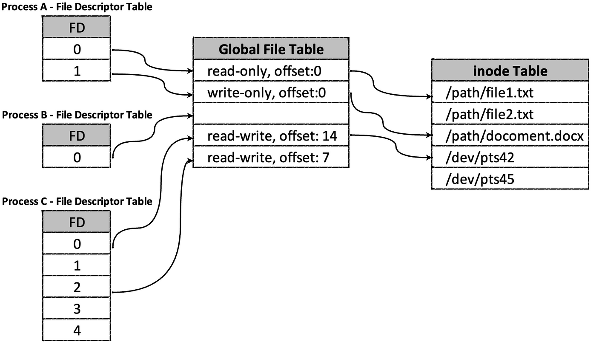

### **File Descriptors**

- A **file descriptor** is a small integer value returned by the kernel when a process successfully opens a file, socket, pipe, or other resource.
- File descriptors act as **handles** that processes use to interact with these resources.
- File descriptors are **process-specific**, meaning each process has its own file descriptor table, mapping these integers to entries in the kernel's **global file table**.

------

### **Global File Table**

The kernel maintains a **global file table** to manage resources like open files and sockets. When a process opens a file:

1. **Access Verification:**
   - The kernel verifies the process's permissions against the file's attributes (stored in the inode structure), ensuring the process has the necessary read, write, or execute rights.
2. **Global File Table Entry:**
   - If access is granted, the kernel creates or updates an entry in the global file table. This entry includes:
     - **Inode Reference:** Points to the file's inode, which contains metadata about the file (e.g., file size, permissions).
     - **Byte Offset:** Tracks the current position in the file for operations like `read()` or `write()`. This offset updates as the process reads or writes data.
     - **Access Mode:** Indicates how the file is being used (e.g., read-only, write-only, read-write).
3. **File Descriptor Assignment:**
   - The kernel assigns the process a file descriptor (an index into the process's file descriptor table).
   - The process uses this file descriptor to reference the corresponding global file table entry when performing operations like `read()`, `write()`, or `close()`.

------

### **Detailed Flow of File Operations**

1. **Opening a File:**
   - System call: `int fd = open("file.txt", O_RDONLY);`
   - The kernel:
     - Verifies access permissions using the inode.
     - Creates an entry in the global file table (if the file is not already open).
     - Adds an entry in the process's file descriptor table, pointing to the global file table entry.
     - Returns the file descriptor (`fd`) to the process.
2. **Reading from a File:**
   - System call: `read(fd, buffer, size);`
   - The kernel:
     - Uses the file descriptor to locate the global file table entry.
     - Retrieves the byte offset and reads the specified amount of data from the file.
     - Updates the byte offset in the global file table entry.
3. **Closing a File:**
   - System call: `close(fd);`
   - The kernel:
     - Removes the file descriptor from the process's file descriptor table.
     - Decrements the reference count in the global file table entry.
     - If the reference count drops to 0 (no process is using the file), the global file table entry is deleted.

------

### **Relationship Between Tables**

1. **Process-Specific File Descriptor Table:**
   - Maps file descriptors to entries in the global file table.
   - Each process has its own file descriptor table.
2. **Global File Table:**
   - Contains information about open files.
   - Shared across processes that open the same file, ensuring consistency.
3. **Inode Table:**
   - Stores metadata about files (e.g., permissions, size).
   - Shared by the global file table entries pointing to the same file.

------

### **Example**

Imagine two processes, A and B, open the same file:

- Both processes will have separate file descriptors (e.g., `3` for process A, `4` for process B).
- Both file descriptors point to the same global file table entry, which points to the same inode.
- Each process maintains its own byte offset in the global file table, allowing independent reads and writes.

------

### **Advantages of This Design**

1. Efficiency:
   - Shared global file table entries reduce redundant metadata storage for files accessed by multiple processes.
2. Consistency:
   - Changes made by one process (e.g., writing to a file) are visible to others sharing the global file table entry.
3. Isolation:
   - Each process has its own file descriptor table, preventing interference between processes.

This design allows the kernel to efficiently manage file I/O while providing processes with a simple and isolated interface.

This image illustrates the relationship between **file descriptor tables**, the **global file table**, and the **inode table** in a multi-process operating system. Here’s a breakdown of its components:

------

### **1. File Descriptor Tables (Process-Specific)**

Each process has its own **file descriptor table**, mapping file descriptors (small integers like `0`, `1`, `2`, etc.) to entries in the **global file table**. The table is unique to each process.

- **Process A:**
  - File descriptor `0` points to a global file table entry for a file opened in **read-only mode** with an offset of `0`.
  - File descriptor `1` points to a global file table entry for a file opened in **write-only mode**, also with an offset of `0`.
- **Process B:**
  - File descriptor `0` points to a file opened in **read-write mode**, with a current offset of `14`.
- **Process C:**
  - File descriptor `0` points to the same entry as Process B’s file descriptor `0`, meaning they share the same global file table entry (and thus the same file offset and permissions).
  - File descriptors `1`, `2`, `3`, and `4` point to other global file table entries, showing multiple open files.

------

### **2. Global File Table**

The **global file table** is shared among all processes and stores information about all open files in the system.

- Each entry contains:
  1. **File Access Mode**: Specifies whether the file is opened in read-only, write-only, or read-write mode.
  2. **Current Byte Offset**: Tracks where the next read or write operation will occur.
  3. **Pointer to the Inode Table**: Links to the file's metadata in the inode table.
- Examples in the image:
  - The first entry is for a file at `/path/file1.txt`, opened in **read-only mode** with an offset of `0`.
  - The second entry is for `/path/file2.txt`, opened in **write-only mode** with an offset of `0`.
  - The third entry (used by Processes B and C) refers to `/path/docoment.docx` (likely a typo for `document.docx`), opened in **read-write mode**, with Process B having an offset of `14` and Process C having the same offset.
  - The fourth entry points to a device file at `/dev/pts42`.

------

### **3. Inode Table**

The **inode table** contains metadata for each file, such as:

- File path (e.g., `/path/file1.txt`).
- File size, ownership, permissions, and other attributes.
- This table is referenced by the global file table.
- Example:
  - `/path/file1.txt` and `/path/file2.txt` have separate inode entries.
  - `/dev/pts42` and `/dev/pts45` are device files (e.g., virtual terminals or pseudo-terminals).

------

### **Key Relationships in the Image**

1. **Multiple Processes Sharing Global File Table Entries:**
   - Process B and Process C share the same global file table entry (third entry), meaning they are working on the same file (`/path/docoment.docx`) and share the same offset and access mode.
2. **Process Isolation via File Descriptor Tables:**
   - File descriptors in each process are isolated. For example, Process A’s `FD 0` does not interfere with Process B’s `FD 0`, even though they refer to different global file table entries.
3. **Efficient Resource Sharing:**
   - The global file table allows efficient sharing of file information across processes, avoiding duplication of metadata while maintaining process-specific access.

------

### **Summary**

This image demonstrates how the operating system efficiently manages open files and resources by:

- Providing each process its own file descriptor table for isolation.
- Maintaining a shared global file table for file access consistency and metadata sharing.
- Using an inode table for storing permanent file metadata.
