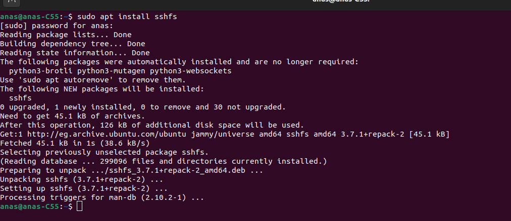
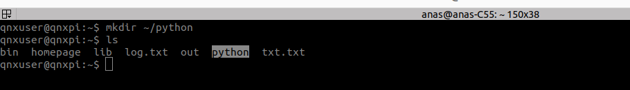
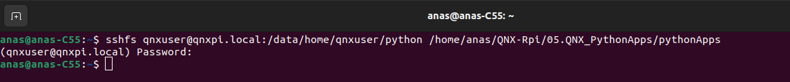
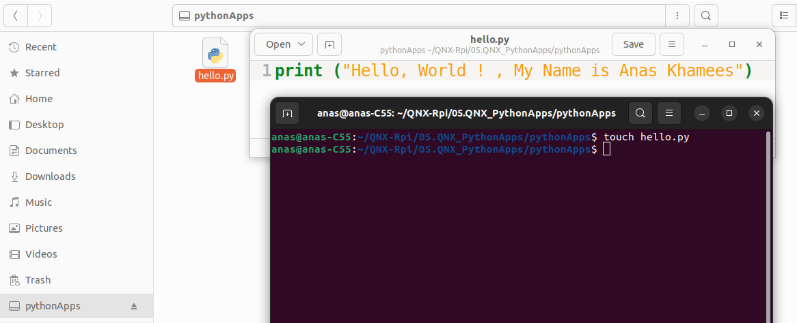
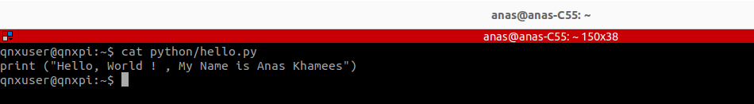
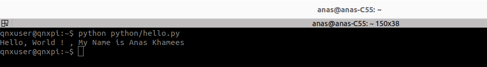
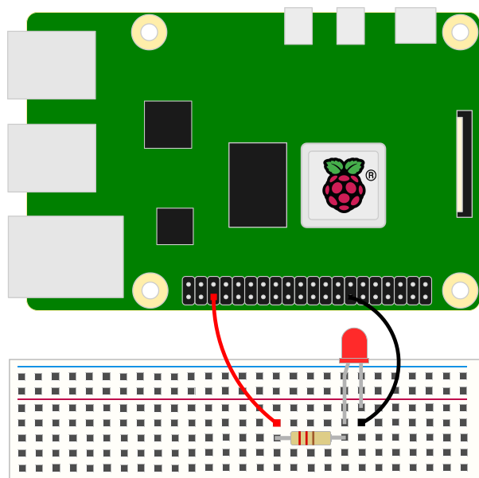
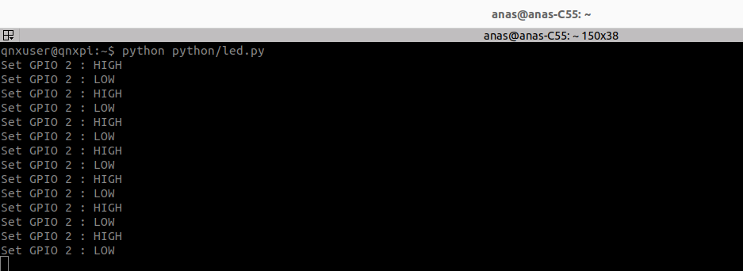

# Develop Python Apps on QNX-Rpi
The Python libraries for GPIO and I2C included with the QNX image for Raspberry Pi
have been designed to be as compatible as possible with those available for other
operating systems. There are many Options for Storing Files on the Raspberry Pi :

- **Write Code Directly on the Raspberry Pi** using **Vim** or **nano** text editor.

- **Use SSHFS (Secure Shell File System)**   [**I will use this Method**] .

  >**SSHFS** allows you to mount a directory from the Raspberry Pi onto your local computer. When this is done, the Raspberry Pi's directory appears as a local directory on your computer, enabling you to work on files directly as if they were local.
  >
  >- Changes you make to files in this mounted directory are saved directly on the Raspberry Pi.
  >
  >- Workflow:
  >
  >  1. Install SSHFS on your local computer:
  >
  >     ```
  >     sudo apt install sshfs
  >     ```
  >
  >     
  >
  >  2. Mount the Raspberry Pi directory, in my case `pyhton` directory:
  >
  >     ```
  >     sshfs pi@raspberrypi: <rpi_directory> <localComputer_mount_point>
  >     ```
  >
  >     This mounts the `rpi_directory`  from the Raspberry Pi to `localComputer_mount_point`
  >
  >      on your local machine.
  >
  >  3. Work on files under local host directory, and they will automatically be saved to the Raspberry Pi.

- **Write Code on local computer then Copy Files to the Raspberry Pi using SCP (Secure Copy Protocol) or FTP**

  

### 1. Hello World Python App 

```python
print("Hello World! , My Name is Anas Khamees")
```

The code stored in a folder called `python` under the home directory of the **qnxuser user**.
The full path for a file called hello.py is thus `/data/home/qnxuser/python/hello.py`
or, using an abbreviated notation, `~qnxuser/python/hello.py`.

- **Create `python` directory under `home directory` on QNX Rpi**

```
mkdir ~/python
```



- **Mount the `python` directory from the rpi to your computer**, open terminal on computer :

```bash
sshfs qnxuser@qnxpi.local:path_to_python(rpi)  path_to_mountPoint(computer)
```

```bash
sshfs qnxuser@qnxpi.local:/data/home/qnxuser/python /home/anas/QNX-Rpi/05.QNX_PythonApps/pythonApps

```




- **Create python file on your host machine** over the rpi mounted directory



- **Let's Ensure that , this file automatically updated on QNX Rpi** (Target)



- **Run the Python Code **

```bash
python path_to_file
```



>**Note that :**
>
>I use Remote Execution using SSH :
>While SSH can be used to start a shell on the Raspberry Pi, it can also be used to
>execute a command remotely.


### 2. Led Control App

The Python libraries for GPIO included with the QNX image for Raspberry Pi 4.

- Connect the Led and resistor (10 K ohm ) to the RPI4 pin

  

- **Develop the app on the rpi mounted directory on computer**

```python
import rpi_gpio as GPIO
import time
# I use GPIO 2
GPIO.setup(2,GPIO.OUT)
GPIO.output(2,GPIO.LOW)

while True:
	GPIO.output(2,GPIO.HIGH)
	time.sleep(0.5)
	GPIO.output(2,GPIO.LOW)
	time.sleep(0.5)
```

- **Open Remote SSH  with RPI and run the code**

```bash
python /python/led.py
```




https://github.com/user-attachments/assets/36f37ad0-d521-4637-8eee-7627bb4f6390

